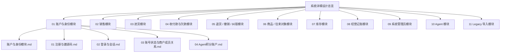
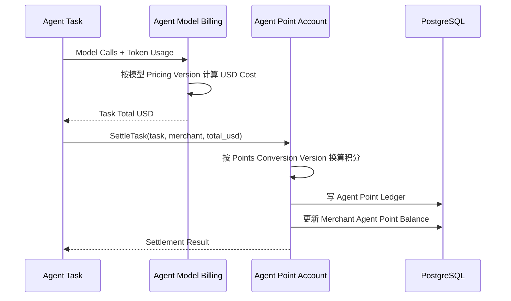

# master-goods vNext 系统详细设计总览

> 状态：持续设计  
> 结构原则：**一个业务模块对应一个顶层模块文档；模块下面再拆子模块详细设计。**  
> 表达方式：核心流程以 Mermaid `sequenceDiagram` 为主。  
> 普通 CRUD、页面布局、输入框字段不单独建立系统级设计文档。

# 1. 文档分层



# 2. 当前优先设计范围

当前先完成：

```text
01 账户与身份
02 卖货
03 进货
```

Agent 作为独立专题，不混入卖货 / 进货主流程。

# 3. 模块职责边界

## 账户与身份模块

负责：

```text
User
Merchant
Membership
Role
Account Status
Invitation
Session
Mobile Auto Login
Agent Point Account
Agent Point Ledger
```

Agent 积分被视为**平台账户体系的一种 Merchant 级积分账户**。

## Agent 模块

负责：

```text
Provider
Model
Model ID
Chat Completions / Responses
Reasoning / Variant
Runtime Config
LLM Usage
Token USD Pricing
Agent Task / Model Call
```

Agent 模块不直接维护 Merchant 积分余额。

# 4. Agent 计费职责拆分



边界：

- 模型 Token 美元定价：Agent 模块；
- USD → Points 换算规则：账户模块；
- 积分余额、负数、充值抵扣、流水：账户模块；
- Task / Model Call usage：Agent 模块。

# 5. 文档规则

每个顶层模块文档只负责：

1. 定义模块职责；
2. 定义子模块边界；
3. 给出模块间关系；
4. 指向详细设计文档；
5. 记录已冻结和待确认决策。

详细时序放在对应子模块文档中，避免一个巨型文档无限增长。
