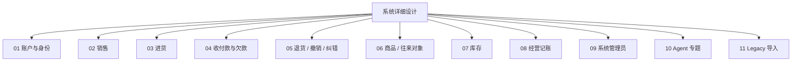

# master-goods vNext 系统详细设计总览

> 状态：持续设计  
> 文档组织：**系统总览 → 顶层模块文档 → 子模块详细设计文档**。  
> 设计表达：核心流程优先使用 Mermaid `sequenceDiagram`。  
> 普通 CRUD、页面布局和字段排版不单独建立系统级流程文档。

# 1. 顶层模块



当前优先讨论：

1. 账户与身份；
2. 卖货；
3. 进货。

Agent 保持独立专题；Agent 积分余额属于账户模块，模型调用与 Token/USD 成本属于 Agent 模块。

# 2. 账户与身份模块文档

```text
01-账户与身份/
├── 账户与身份模块.md
├── 01-注册与邀请码.md
├── 02-登录与会话.md
├── 03-用户资料与账号管理.md
├── 04-密码与账号恢复.md
├── 05-验证方式与安全策略.md
├── 06-账号状态与商户成员关系.md
├── 07-Agent积分账户.md
└── 08-设计模式与判断算法清单.md
```

# 3. 文档职责

顶层模块文档负责：

- 模块职责；
- 子模块关系；
- 已冻结产品规则；
- 关键设计模式与算法原则。

子模块文档负责：

- 主流程；
- 分支流程；
- 边界条件；
- 风险和安全策略；
- 一致性与审计；
- 后续实现必须遵守的约束。

`08-设计模式与判断算法清单.md` 用于下一阶段集中梳理本模块还应拆分的设计模式、Policy、状态机、判定算法与性能算法。
