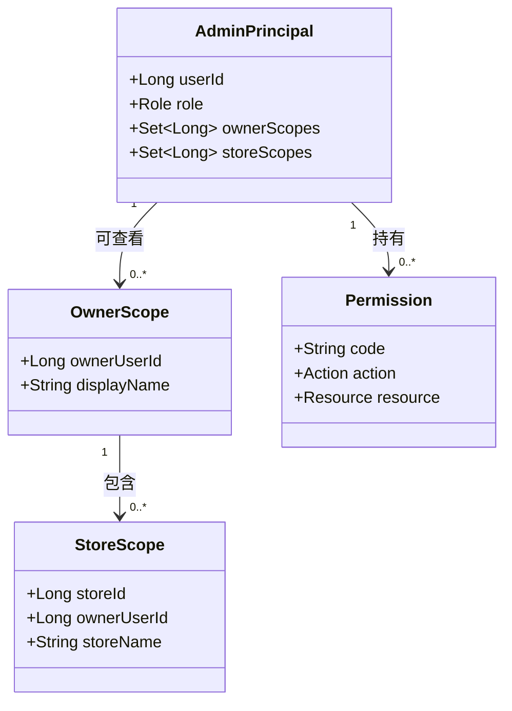

# 管理员角色与数据权限

## 文档信息

| 字段 | 内容 |
|---|---|
| 文档类型 | 业务需求与权限边界 |
| 当前状态 | 规划中 |
| 适用端 | 管理员 Web 后台、管理员 API |
| 角色数量 | 2 类：超级管理员、审计观察员 |
| 依据正式项目 | `UserEntity`、`StoreEntity`、`StoreMembershipEntity`、`StoreAccessPolicy` |
| 最后核对 | 2026-08-28 |

## 一、角色定义

| 角色 | 目标 | 数据范围 | 可执行动作 | 明确禁止 |
|---|---|---|---|---|
| `SUPER_ADMIN` 超级管理员 | 负责平台组织、运行策略和高风险管理 | 全部 owner、全部门店及其成员；跨租户统计需受审计 | 查看、筛选、管理用户/门店/成员；管理角色权限；管理模型 ID 和工具开关；查看 Agent 运行；处理管理员配置 | 查看或导出未经脱敏的凭据；绕过业务确认直接写业务表 |
| `AUDIT_OBSERVER` 审计观察员 | 负责运行、权限和合规观察 | 被授予的全部 owner/store 范围；默认只读 | 查看用户、门店、成员、Agent 运行、Token、工具链、审计和系统指标 | 创建/停用账号；变更角色；改变模型或工具配置；确认草稿；删除审计证据 |

审计观察员同时承担“只读观察员”与“只读审计员”职责，系统不再另建第二个只读角色。角色名称、显示标签和接口权限必须使用同一份权限字典。

## 二、权限资源模型

权限判断必须同时考虑三件事：

1. 管理员身份是否拥有目标动作权限。
2. 请求中的 owner/store 是否属于管理员的数据范围。
3. 目标资源的实际归属是否与请求上下文一致。

仅隐藏前端菜单或按钮不能算授权完成。每个管理员接口都需要在服务端重新计算这三项条件。

## 三、权限矩阵

| 权限代码 | 资源 | 超级管理员 | 审计观察员 | 记录要求 |
|---|---|---:|---:|---|
| `admin.dashboard.read` | 平台指标 | 是 | 是 | 记录查询范围和时间 |
| `admin.user.read` | 用户 | 是 | 是 | 记录筛选条件与结果摘要 |
| `admin.user.manage` | 用户状态与账号 | 是 | 否 | 记录目标用户和变化前后状态 |
| `admin.store.read` | 门店 | 是 | 是 | 记录 owner/store 范围 |
| `admin.store.manage` | 门店与成员关系 | 是 | 否 | 记录关系变化与操作者 |
| `admin.permission.manage` | 管理员角色权限 | 是 | 否 | 高风险操作，记录授权依据 |
| `admin.agent.run.read` | Agent 运行 | 是 | 是 | 记录 run/conversation ID |
| `admin.agent.content.read` | 对话和工具内容 | 是 | 按脱敏策略 | 每次读取单独审计 |
| `admin.agent.config.read` | 模型/工具配置 | 是 | 是 | Provider 敏感值永不返回 |
| `admin.agent.config.manage` | 模型 ID、工具开关 | 是 | 否 | 记录旧值、新值和生效范围 |
| `admin.audit.read` | 审计记录 | 是 | 是 | 不能修改、删除或伪造 |
| `admin.system.read` | 健康、版本、指标 | 是 | 是 | 记录查询范围 |
| `admin.system.retention.manage` | 保留策略 | 是 | 否 | 记录策略变化与生效时间 |
| `admin.export` | 脱敏报表导出 | 是 | 按明确授权 | 记录字段、范围、文件摘要和过期时间 |

## 四、owner 与 store 数据范围

| 请求情况 | 服务端处理 | 结果 |
|---|---|---|
| 超级管理员不带筛选 | 查询全部允许的 owner/store | 聚合结果可以跨 owner，但每行仍带归属标识 |
| 超级管理员指定 owner | 校验 owner 存在并查询其全部门店 | 只返回该 owner 范围 |
| 审计观察员不带筛选 | 使用其授权范围生成查询条件 | 只返回被授权的 owner/store |
| 审计观察员请求未授权 owner | 权限范围服务拒绝 | `403`，不执行数据查询 |
| 任意角色请求未授权 store | 校验 store 与 owner、授权范围的关系 | `403`，不返回资源是否存在的额外信息 |
| 资源 ID 属于其他 owner/store | Repository 查询必须带作用域 | 视为不可见，不能靠前端过滤 |
| 仅传 store、不传 owner | 服务端从 store 关系解析并再次校验 | 不接受客户端自定义 owner 关系 |

对 Agent 运行，运行记录中的 `owner_user_id`、`store_id`、`actor_user_id` 必须分别保留。`actor_user_id` 是实际发起对话的用户，`owner_user_id` 是数据归属，`store_id` 是运行门店，三者不能混为同一字段。

## 五、敏感数据显示规则

| 数据 | 超级管理员 | 审计观察员 | 日志规则 |
|---|---|---|---|
| 用户 ID、门店 ID | 可见 | 可见 | 正常记录访问事件 |
| 用户昵称、手机号 | 按业务需要显示 | 默认部分脱敏 | 不写入调试日志 |
| 登录时间、来源 IP、User-Agent 摘要 | 可见 | 可见 | 记录查询者与查询时间 |
| 输入/输出/总 Token | 可见 | 可见 | 只记录数量和口径 |
| 模型 ID | 可查看、可管理 | 可查看 | 不包含 Provider 密钥 |
| 对话正文 | 按内容权限和脱敏策略 | 默认脱敏或摘要 | 原文查看需单独审计 |
| 工具名、调用顺序、状态 | 可见 | 可见 | 参数按字段级脱敏 |
| Cookie、密码、Session Token、私钥、模型密钥 | 永不显示 | 永不显示 | 发现此类字段必须拒绝落日志 |
| 模型隐藏推理 | 不显示 | 不显示 | 只保留计划摘要和执行事实 |

## 六、高风险动作确认

超级管理员执行账号停用、角色变更、模型 ID 变更、工具开关、数据导出和保留策略变更时，页面需要展示影响范围与二次确认；服务端再次校验权限、版本和请求幂等性。审计观察员没有这些动作入口。

Agent 创建类任务仍遵循业务侧的“草稿—确认—写入”流程。管理员后台能够观察确认状态和写入结果，不能把查看按钮设计成替用户确认。

## 对应实现

- 权限入口参考：`Code/backend/src/main/java/com/zhihuiji/backend/application/service/store/StoreAccessPolicy.java`
- 门店权限拦截参考：`Code/backend/src/main/java/com/zhihuiji/backend/infrastructure/security/StorePermissionInterceptor.java`
- Web 会话权限参考：`Code/frontend/web/src/app/stores/session.ts`
- 当前原型管理员身份展示：`Temp/grok-style-admin-preview/src/App.jsx`

## 对应接口

权限校验由服务端管理员身份解析、`AdminScopeService` 和各领域服务共同完成，具体接口见 `docs/管理员后台/03_系统设计/权限设计/管理员后台权限与数据范围设计.md`。

## 对应测试

- 每个权限代码至少需要正向、反向、跨 owner、跨 store 和无会话用例。
- 审计观察员尝试写操作必须得到稳定 `403`，且写库断言为零。
- 超级管理员查询全部范围时必须验证分页、总数和每行归属。
- 敏感字段测试只使用假数据，断言响应和日志均没有凭据内容。

## 当前限制

- 正式项目当前已有业务角色和门店成员机制；管理员专用角色、权限字典和管理员审计表尚未在本目录实现。
- 观察员的具体 owner/store 授权来源需要在正式开发前确定，是由角色绑定、授权表还是现有成员关系派生。
