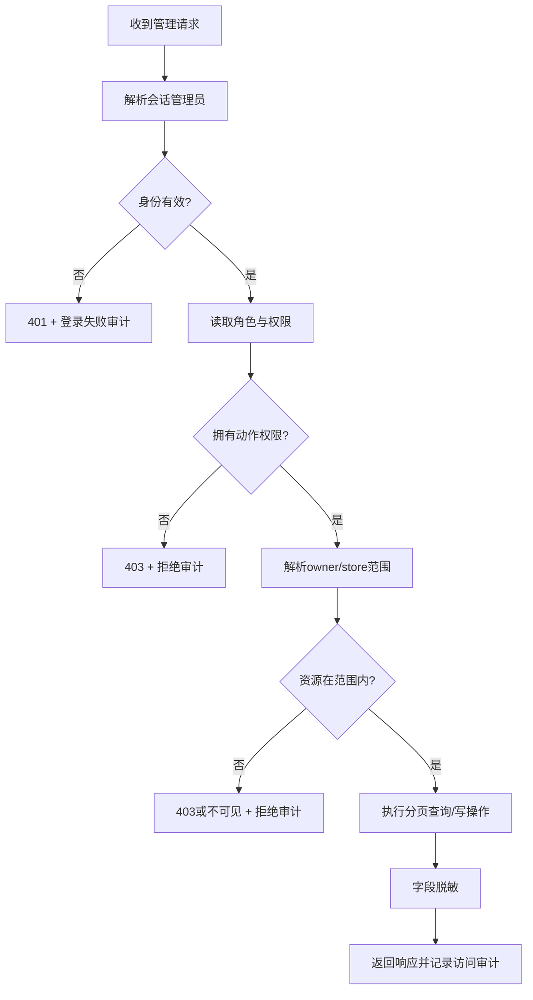

# 管理员后台安全与审计需求

## 文档信息

| 字段 | 内容 |
|---|---|
| 文档类型 | 安全与审计系统需求 |
| 当前状态 | 安全边界已实现；真实环境验收待执行 |
| 适用端 | 管理员 Web、后端 API、审计存储 |
| 安全前提 | 服务端授权是唯一安全边界，前端显示控制只是辅助体验 |
| 最后核对 | 2026-08-30 |

## 一、威胁范围

| 威胁 | 目标 | 必须控制 |
|---|---|---|
| 未登录访问 | 管理员接口和页面 | 统一认证、会话失效、401 |
| 观察员越权写入 | 用户、成员、配置、草稿 | 服务端权限拒绝、无写库、审计 |
| 跨 owner/store 读取 | 用户、业务表、Agent 运行 | 范围服务与 Repository 双重过滤 |
| ID 猜测 | 运行、消息、审计和导出 | 资源查询带范围，不泄漏存在性 |
| 内容泄露 | 对话、工具参数、结果 | 字段脱敏、内容权限、访问记录 |
| 凭据泄露 | 密码、Cookie、Session、Provider 密钥 | DTO、日志、导出和异常全部排除 |
| 配置误改 | 模型 ID、工具开关、保留策略 | 二次确认、版本、幂等、审计 |
| 过量查询 | 列表、统计和导出 | 分页、上限、限流、异步任务 |
| 审计缺失 | 登录、敏感查看和写操作 | 成功/失败/拒绝均记录 |

## 二、授权处理顺序

授权代码不能只依赖请求中的 `ownerUserId` 或 `storeId`。后台服务需要把当前管理员范围作为不可由客户端覆盖的查询条件。

## 三、审计事件模型

| 字段 | 必填 | 内容 |
|---|---:|---|
| `eventId` | 是 | 审计事件唯一 ID |
| `occurredAt` | 是 | 服务器生成的事件时间 |
| `adminUserId` | 条件必填 | 已认证管理员或非管理员请求保留实际用户 ID；未认证拒绝使用 `NULL`，并以 `role=ANONYMOUS` 标识，不伪造管理员 |
| `role` | 是 | 事件发生时角色 |
| `action` | 是 | `LOGIN`、`READ`、`UPDATE`、`EXPORT`、`DENY` 等 |
| `resourceType` | 是 | 用户、门店、运行、消息、配置、系统等 |
| `resourceId` | 否 | 脱敏后的资源 ID；批量访问可为空并带筛选摘要 |
| `ownerScope` | 是 | 请求作用域摘要 |
| `storeScope` | 否 | 门店范围摘要 |
| `sourceIp` | 是 | 代理链解析后的来源 IP，按部署规范处理 |
| `client` | 是 | User-Agent 摘要、应用版本或客户端类型 |
| `requestId` | 是 | 请求关联 ID |
| `result` | 是 | `SUCCESS`、`FAILED`、`DENIED` |
| `reasonCode` | 否 | 错误或拒绝原因代码 |
| `changedFields` | 否 | 配置或用户状态改变的字段名白名单 |
| `beforeSummary`、`afterSummary` | 否 | 脱敏前后状态摘要，不保存秘密值 |
| `contentAccess` | 是 | 是否读取正文、参数或结果原文 |

## 四、必须审计的动作

| 类别 | 动作 |
|---|---|
| 身份 | 登录成功、登录失败、退出、会话失效、账号停用后访问 |
| 数据读取 | 用户详情、门店成员、对话正文、工具参数/结果、上下文检查点、审计详情 |
| 配置 | 模型 ID 增加/修改/停用、工具开关、保留策略 |
| 组织 | 用户状态、管理员角色、门店成员关系变化 |
| 导出 | 创建、下载、重复下载、过期下载、导出失败 |
| 拒绝 | 未认证、权限不足、跨范围、参数不合法、并发版本冲突 |
| 运维观察 | 查看服务健康、错误摘要和版本信息 |

## 五、内容与日志脱敏

| 内容 | 页面 | 服务日志 | 审计 |
|---|---|---|---|
| 输入/输出 Token 数量 | 可见 | 可记录数量 | 可记录数量 |
| 用户消息正文 | 依内容权限 | 默认不写原文 | 记录已访问及脱敏状态 |
| 工具参数 | 字段白名单摘要 | 不写完整参数 | 记录参数字段名和脱敏摘要 |
| 工具结果 | 结果摘要 | 不写完整结果 | 记录状态、数量和脱敏状态 |
| 模型 ID | 可见 | 可记录 | 可记录 |
| 密码、Cookie、Session、Provider 密钥、私钥 | 永不返回 | 永不写入 | 永不写入 |
| 隐藏推理 | 永不返回 | 永不写入 | 永不写入 |

内容权限应有独立的 `admin.agent.content.read` 权限，不应因为管理员拥有 `admin.agent.run.read` 就自动可以看到全部正文。

## 六、会话与 IP 要求

- 后端生成并校验管理员会话；前端不能在本地存储中伪造角色或范围。
- 记录登录时间、退出时间、最后活动时间、来源 IP、客户端类型和结果。
- 代理部署下只信任配置明确的受信代理头，不能把任意请求头直接当作真实 IP。
- IP 查询展示要遵循组织的隐私和保留策略；审计中保留用于安全追踪的必要字段。
- 会话失效、密码变更、管理员角色变更后，旧会话按策略立即或在短窗口内失效。

## 七、导出安全

导出流程必须采用字段白名单、范围校验、异步任务、短期下载地址和下载审计。导出文件不包含任何凭据、完整认证载荷、未授权正文或模型隐藏推理。重复下载、过期下载和权限变化后的下载都要重新校验。

## 八、安全验收条件

| 条件 | 通过标准 |
|---|---|
| 无会话访问 | 所有管理员 API 返回 `401`，不返回业务数据 |
| 观察员写入 | 返回 `403`，目标表写入次数为 0，产生拒绝审计 |
| 跨范围读取 | 返回拒绝或不可见结果，不泄露资源存在性 |
| 敏感字段 | 响应、日志、导出和异常中均不存在秘密字段 |
| 审计完整性 | 成功、失败、拒绝、查看正文、配置变更都有事件 |
| 配置并发 | 版本冲突不会覆盖他人变更，重复幂等请求不产生多次变化 |
| 内容权限 | 运行元数据权限和正文权限可以独立验证 |

## 对应实现

- 管理员身份、权限和范围：`Code/backend/src/main/java/com/zhihuiji/backend/infrastructure/security/admin/`
- 管理员审计 Service 与实体：`Code/backend/src/main/java/com/zhihuiji/backend/application/service/admin/AdminAuditService.java`、`Code/backend/src/main/java/com/zhihuiji/backend/domain/entity/AdminAuditEventEntity.java`
- Agent 运行审计：`Code/backend/src/main/java/com/zhihuiji/backend/application/service/v2/agent/component/RunAuditService.java`
- 管理员安全迁移：`Code/backend/src/main/resources/db/migration/V35__administrator_identity_and_scope.sql`、`V37__admin_audit_config_exports_retention.sql`、`V38__admin_mutation_versions.sql`
- 管理员原型审计卡片：`Temp/grok-style-admin-preview/src/App.jsx`

## 对应接口

安全规则适用于 `API-ADM-01` 至 `API-ADM-15`；当前 Controller 和 Service 已统一调用服务端管理员身份、权限、范围和 DTO 脱敏边界，不允许某个接口自定义一套更宽松的错误或脱敏规则。

## 对应测试

使用假管理员和假 owner/store 数据执行未登录、越权、跨范围、敏感字段、注入式筛选、重复提交、导出和审计完整性测试。测试日志只保存脱敏请求摘要和证据路径。

## 当前限制

管理员专用账户/范围表、管理员审计表、内容权限判断、配置并发和导出字段白名单已实现并有管理员测试覆盖。当前复用统一认证，尚无独立登录/退出接口；真实登录退出、跨 owner/store HTTP、受信代理 IP 解析、审计失败策略、保留期限和生产数据验收仍待确认。
