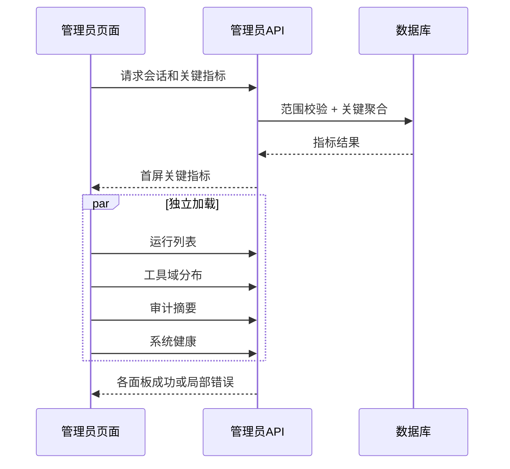

# 管理员后台性能与可观测性需求

## 文档信息

| 字段 | 内容 |
|---|---|
| 文档类型 | 性能与可观测性系统需求 |
| 当前状态 | 指标已定义；目标环境实测待执行 |
| 适用端 | 管理员 Web、后端 API、数据库和 Agent 观测链路 |
| 指标前缀 | `admin_`、`agent_admin_` |
| 重要限制 | 目标数值是待验证指标，不是当前实测结果 |
| 最后核对 | 2026-08-30 |

## 一、性能目标

| 场景 | 目标 | 测量口径 |
|---|---:|---|
| 当前管理员会话 | p95 ≤ 500 ms | 不含浏览器资源下载 |
| 用户/门店列表 | p95 ≤ 1.0 s | 过滤、排序、分页和 count 完整返回 |
| Agent 运行列表 | p95 ≤ 1.5 s | 时间、状态、owner/store 和分页过滤 |
| 运行详情 | p95 ≤ 1.5 s | 主记录、事件首屏和摘要；正文可独立请求 |
| 平台总览 | p95 ≤ 3.0 s | 聚合指标和趋势摘要，按面板独立返回 |
| 运行事件加载 | 首批事件 ≤ 1.0 s | 首批分页或流式事件，不等待全部正文 |
| 导出创建 | 接口确认 ≤ 1.0 s | 只确认任务创建；文件生成异步 |
| 管理员实时刷新 | 单次刷新不超过 1 个请求/面板 | 避免轮询放大 |

## 二、查询设计要求

- 列表的过滤、排序、分页和总数计算必须下推到 Repository/数据库，不能先取全表再在 JVM 内截取。
- 所有查询都带 `owner_user_id`，需要门店时同时带 `store_id`；排序字段使用白名单和稳定主键兜底。
- 运行详情先加载摘要，再按需加载消息正文和大事件结果；大字段不进入首页列表。
- Token 聚合按时间、模型、owner/store 和终态分组，避免每次扫描全部消息正文。
- 统计查询与写入业务使用合理的连接池和超时；管理查询超时不得拖垮普通门店请求。
- PostgreSQL 查询计划需要在有真实 PostgreSQL 服务时用 `EXPLAIN`/`EXPLAIN ANALYZE` 执行核对；没有该环境时只能保留 SQL、索引预期和 `Deferred`/`Blocked` 记录，不能用其他数据库结论替代。

## 三、可观测指标

| 指标 | 类型 | 标签 | 用途 |
|---|---|---|---|
| `admin_api_requests_total` | counter | route、method、status、role | 请求量和错误率 |
| `admin_api_latency_ms` | histogram | route、status | p50/p95/p99 延迟 |
| `admin_scope_denied_total` | counter | resource、role、reason | 越权尝试趋势 |
| `admin_query_rows` | histogram | queryName、scopeType | 返回规模和分页质量 |
| `admin_db_query_ms` | histogram | repository、operation | 慢查询定位 |
| `admin_panel_failure_total` | counter | panel、reason | 前端局部失败 |
| `admin_export_jobs_total` | counter | type、status | 导出任务状态 |
| `agent_admin_run_detail_latency_ms` | histogram | terminalStatus、contentMode | 运行详情体验 |
| `agent_admin_tool_event_gap_total` | counter | eventType | 工具链缺失事件 |
| `agent_admin_usage_estimated_total` | counter | modelId | Token 估算比例 |
| `admin_audit_write_failure_total` | counter | action、resource | 审计可靠性 |

## 四、日志和关联 ID

每次请求至少关联 `requestId`；运行详情还关联 `runId`、`conversationId`；数据库查询记录安全的 query 名称和耗时，不记录完整 SQL 参数中的敏感内容。前端错误记录面板、接口、request ID 和状态，不记录会话凭据或完整正文。

## 五、前端加载策略

单个面板失败时保留其他面板的成功结果，显示错误原因类别和重试按钮。重试应只请求失败面板，不能触发全页重复请求。

## 六、性能测试用例

| 用例 | 输入 | 关注指标 | 通过条件 |
|---|---|---|---|
| PERF-ADM-01 | 空数据库范围 | 首屏、空列表、错误率 | 结果明确，不能等待或报错 |
| PERF-ADM-02 | 单 owner、多门店分页 | 列表 p95、DB 行数 | 查询行数接近 page/size，非全量读取 |
| PERF-ADM-03 | 多 owner 聚合 | 总览 p95、连接池 | 在目标并发下不影响业务接口 |
| PERF-ADM-04 | 长运行事件 | 详情 p95、响应大小 | 先摘要后大字段，响应受控 |
| PERF-ADM-05 | 高频刷新 | 请求数、前端渲染 | 请求合并/节流，局部失败可重试 |
| PERF-ADM-06 | 并发导出 | 队列、CPU、文件过期 | 任务隔离，下载和清理可追踪 |
| PERF-ADM-07 | 跨范围攻击流量 | 拒绝率、审计写入 | 全部拒绝，不能通过缓存命中数据 |
| PERF-ADM-08 | PostgreSQL 计划 | `EXPLAIN`、索引命中 | 有真实 PostgreSQL 后才执行；否则标记阻塞/延期 |

## 七、告警和处置

| 告警 | 条件 | 处理入口 |
|---|---|---|
| 管理 API 错误率升高 | 5xx 或下游错误超过阈值 | 查看 request ID、服务健康和错误摘要 |
| 越权拒绝异常升高 | `admin_scope_denied_total` 短时突增 | 核查账号、IP、范围和审计事件 |
| 审计写入失败 | 连续失败或积压 | 暂停高风险配置操作，检查审计存储 |
| 运行事件缺失 | tool 事件配对缺失 | 关联 Agent run 审计和 SSE 发送日志 |
| Token 估算比例升高 | Provider 用量缺失 | 检查模型适配器和用量字段映射 |
| 管理查询慢 | p95 超目标 | 查 Repository、索引和查询计划 |

## 对应实现

- 分页与管理员查询：`Code/backend/src/main/java/com/zhihuiji/backend/api/common/PaginationUtils.java`、`Code/backend/src/main/java/com/zhihuiji/backend/infrastructure/repository/admin/`
- Agent 运行、事件和用量：`Code/backend/src/main/java/com/zhihuiji/backend/application/service/admin/AdminAgentDetailService.java`、`AdminAgentEventStreamService.java`
- 系统健康摘要：`Code/backend/src/main/java/com/zhihuiji/backend/application/service/admin/AdminSystemService.java`
- 原型实时日志和指标：`Temp/grok-style-admin-preview/src/App.jsx`

## 对应接口

性能要求适用于 `API-ADM-02`、`03`、`04`、`05`、`06`、`07`、`08`、`09`、`12`、`13`、`14`。

## 对应测试

测试报告必须区分本地构建、测试环境实测、真实 PostgreSQL 查询计划和目标环境实测；不可把设计目标写成通过结论。

## 当前限制

管理员查询和健康代码已存在，管理员源码测试已通过；当前没有目标环境性能实测、生产数据集、真实 PostgreSQL `EXPLAIN/EXPLAIN ANALYZE`、目标并发和部署网络延迟证据。设计目标不能视为性能通过，Provider Token 累计/单次语义也需业务确认。
