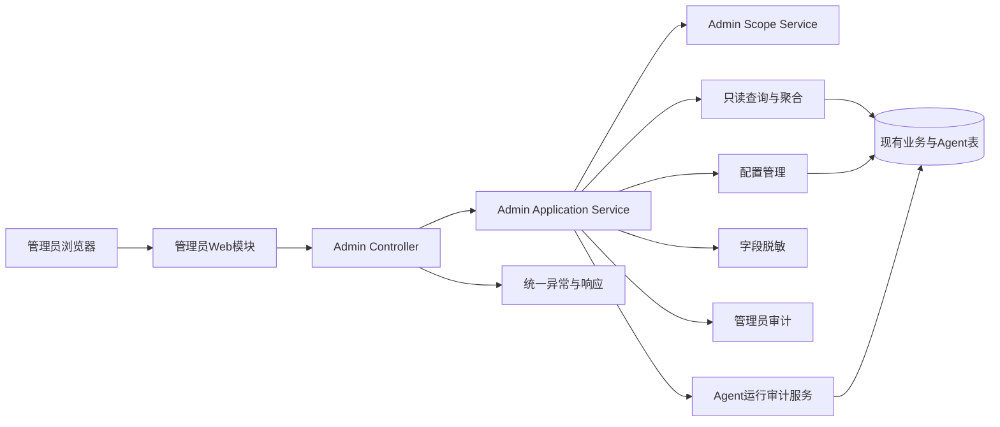

# 管理员后台系统需求总览

## 文档信息

| 字段 | 内容 |
|---|---|
| 文档类型 | 业务系统需求总览 |
| 当前状态 | 实现中；管理员契约测试已通过 |
| 适用端 | 管理员 Web、管理员后端 API、现有 Agent 运行服务 |
| 需求前缀 | `SR-ADM` |
| 业务依据 | `docs/管理员后台/01_业务需求/` 下管理员后台文档 |
| 最后核对 | 2026-08-30 |

## 一、系统目标

系统应在不改变现有门店业务和 Agent 核心执行链的前提下，提供一个独立的管理员访问边界。管理员后台通过后端服务读取聚合数据，完成组织管理、Agent 运行观测、使用量分析、模型与工具策略管理、审计和系统健康查看。

系统目标分为四层：

1. **可访问**：管理员可以可靠登录，并只看到其角色与范围允许的功能。
2. **可解释**：每个统计数字、运行状态和工具事件都有时间、范围、来源和关联 ID。
3. **可追溯**：登录、查看、配置变更、导出和拒绝操作都能追到操作者、IP、资源和结果。
4. **可控制**：模型 ID、工具启用状态和高风险动作有服务端校验、二次确认和事务边界。

## 二、系统边界

| 边界 | 系统行为 |
|---|---|
| 浏览器到后端 | 只使用 HTTPS 和受保护 API；浏览器不携带或展示 Provider 密钥 |
| 后端到业务数据库 | 通过 Repository/Query Service 查询；所有请求带管理员范围条件 |
| 后端到 Agent | 只读访问运行、消息、工具事件、草稿和上下文记录；不改变用户运行状态 |
| 管理员配置 | 只允许超级管理员更新模型 ID、工具开关和保留策略；写入需审计 |
| 审计系统 | 管理员审计与 Agent 运行审计互相关联，但用途和字段边界分开 |
| 临时原型 | 只验证页面表达，不参与正式运行链路 |

## 三、系统需求清单

| 编号 | 需求 | 优先级 | 验收方式 |
|---|---|---|---|
| SR-ADM-01 | 管理员身份认证、会话恢复与退出 | 高 | API 与会话测试 |
| SR-ADM-02 | 服务端角色和 owner/store 范围校验 | 高 | 正反权限与跨范围测试 |
| SR-ADM-03 | 首页指标按时间和范围查询 | 高 | 聚合结果、空数据和分页测试 |
| SR-ADM-04 | 用户、门店和成员关系管理 | 高 | CRUD、状态和审计测试 |
| SR-ADM-05 | Agent 运行、消息和工具事件关联查询 | 高 | run 链路完整性测试 |
| SR-ADM-06 | Token、耗时、首字延迟和轮次统计 | 高 | 统计口径与边界测试 |
| SR-ADM-07 | 上下文窗口、检查点和压缩事件查询 | 中 | 事件与数据一致性测试 |
| SR-ADM-08 | 草稿、确认和正式业务引用查看 | 高 | 状态机与无写入测试 |
| SR-ADM-09 | 模型 ID、工具开关和版本管理 | 中 | 配置校验、并发和审计测试 |
| SR-ADM-10 | 登录、查看、变更和导出审计 | 高 | 审计完整性测试 |
| SR-ADM-11 | 系统健康、版本和错误摘要 | 中 | 脱敏与故障状态测试 |
| SR-ADM-12 | 脱敏导出与数据保留策略 | 中 | 字段白名单、下载和清理测试 |
| SR-ADM-13 | 大数据量下的分页和聚合性能 | 中 | 负载、慢查询和查询计划测试 |
| SR-ADM-14 | Web 响应式页面和可访问状态表达 | 中 | 静态构建、组件和人工核验 |

## 四、通用系统约束

| 约束 | 要求 |
|---|---|
| ID | 后端使用 `Long`；Web 以字符串处理大 ID，不能使用可能损失精度的普通数字转换 |
| 时间 | 接口使用带时区的 ISO 8601；统计接口明确时间区间是闭开还是闭闭 |
| 分页 | 使用 `page`、`size`、稳定排序和 `total`；服务端限制最大 `size` |
| 响应 | 延续项目统一 `ApiResponse` 结构，错误由统一异常处理输出 |
| 范围 | 任何查询都由服务端拼接 owner/store 条件；客户端筛选不能扩大范围 |
| 内容 | 对话和工具原文按字段脱敏；模型隐藏推理不进入管理后台 |
| 写操作 | 状态改变、配置和导出必须有权限校验、幂等策略和审计事件 |
| 运行状态 | 只使用 `COMPLETED`、`FAILED`、`CANCELLED`、`EXHAUSTED` 等明确终态，不使用模糊状态 |

## 五、非功能目标

以下数值是正式实现前的设计目标，尚未代表实测结果：

| 类别 | 目标 |
|---|---|
| 可用性 | 管理员查询接口错误响应可解释；下游不可用时页面保留局部错误和重试入口 |
| 读取延迟 | 常用列表和运行详情 p95 ≤ 1.5 秒；大范围统计 p95 ≤ 3 秒 |
| 首屏 | 不等待所有面板完成；关键指标优先返回，次要面板可独立加载 |
| 并发 | 在目标管理员并发量下，查询不引起业务 API 线程池和数据库连接池耗尽 |
| 审计 | 敏感查看和写操作成功、失败、拒绝都生成审计，审计字段不包含凭据 |
| 安全 | 跨 owner/store 查询、越权写操作和敏感字段泄露测试全部失败即阻断发布 |
| 可恢复性 | 单个统计面板失败不影响其他面板；导出使用可追踪异步任务 |
| 可访问性 | 键盘可达、焦点可见、状态不只靠颜色、表格具备语义标题 |

## 六、完成判定

一个功能只有同时满足以下条件才标记为“已完成”：

1. 业务需求、接口契约、权限资源和数据来源存在对应编号。
2. 正常、空数据、参数错误、未登录、无权限和跨范围场景都有测试记录。
3. 页面显示的内容与接口响应字段一致，失败状态不会被旧数据静默覆盖。
4. 影响数据或配置的操作有审计事件，且敏感字段经过脱敏。
5. 真实环境、构建、测试和限制已经在结果文档中分别记录。

## 对应实现

- 统一响应与分页：`Code/backend/src/main/java/com/zhihuiji/backend/api/common/ApiResponse.java`、`PaginationUtils.java`
- 管理员入口与 DTO：`Code/backend/src/main/java/com/zhihuiji/backend/api/controller/admin/`、`api/dto/admin/`
- 管理员服务、范围授权和查询：`Code/backend/src/main/java/com/zhihuiji/backend/application/service/admin/`、`infrastructure/security/admin/`、`infrastructure/repository/admin/`
- Agent 运行与草稿确认：`Code/backend/src/main/java/com/zhihuiji/backend/application/service/v2/agent/`
- 独立 Web 管理员工程：`Code/frontend/admin-web/`
- 当前原型：`Temp/grok-style-admin-preview/`

## 对应接口

系统需求对应的实际接口见 `管理员后台接口与数据需求.md`；入口实现位于 `Code/backend/src/main/java/com/zhihuiji/backend/api/controller/admin/`。

## 对应测试

已执行管理员源码/契约测试：`./Code/backend/gradlew -p Code/backend test --tests '*admin.*' --no-parallel --rerun-tasks --no-daemon`（2026-08-30，`BUILD SUCCESSFUL`）。真实 HTTP、数据库和目标环境证据仍按 `SR-ADM` 编号登记。

## 当前限制

管理员 Controller、身份解析、范围授权、读写服务、审计/配置/导出/保留策略和 Agent 观测实现已上线，V35-V41 迁移已部署。独立管理员 Web 的登录/退出页面、跨 owner/store 页面、PostgreSQL `EXPLAIN` 和目标并发证据仍待补齐；上述延迟和并发数值仍是设计目标。
