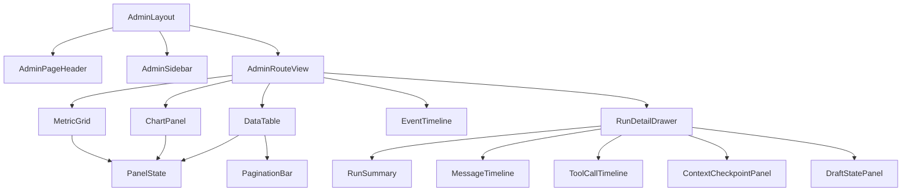

# 管理员后台前端模块设计

## 文档信息

| 字段 | 内容 |
|---|---|
| 文档类型 | 前端系统设计 |
| 当前状态 | 独立工程骨架已建立；页面实现未开始 |
| 正式技术栈 | Vue 3 + TypeScript + Vite |
| 正式位置 | `Code/frontend/admin-web/src/` |
| 临时原型 | React + Vite，仅用于视觉核验 |
| 最后核对 | 2026-08-30 |

## 一、模块目录

```text
Code/frontend/admin-web/src/
├── app/
│   ├── layouts/                           # 管理员应用壳层
│   ├── router/                            # 路由与路由级权限
│   └── stores/                            # 管理员会话与范围状态
├── entities/admin/                        # DTO、状态与展示模型
├── features/
│   ├── auth/                              # 登录和会话恢复
│   ├── overview/                          # 平台总览
│   ├── organization/                      # 用户、门店和成员关系
│   ├── agent-observability/               # 运行、事件、用量和上下文
│   ├── audit/                             # 操作审计和导出
│   └── system/                            # 配置、健康和保留策略
├── pages/                                 # 路由页面组合
└── shared/
    ├── api/                               # 受控 API 客户端
    └── components/                        # 无业务耦合的通用组件
```

管理员工程与 `Code/frontend/web/` 的店主端物理隔离。可参考既有通用工具的实现，但不共享路由、会话状态、页面目录或构建产物。

## 二、路由与菜单

| 路由 | 页面 | 读取权限 | 写权限 |
|---|---|---|---|
| `/overview` | `AdminOverviewPage` | `admin.dashboard.read` | 无 |
| `/users` | `AdminUsersPage` | `admin.user.read` | `admin.user.manage` |
| `/agent/runs` | `AdminAgentRunsPage` | `admin.agent.run.read` | 无 |
| `/agent/config` | `AdminAgentConfigPage` | `admin.agent.config.read` | `admin.agent.config.manage` |
| `/audit` | `AdminAuditPage` | `admin.audit.read` | `admin.export` 受限 |
| `/system` | `AdminSystemPage` | `admin.system.read` | `admin.system.retention.manage` |

路由守卫只做快速导航控制，接口请求仍必须由服务端重新认证和授权。没有权限的菜单可以隐藏，但直接输入 URL 必须得到受控拒绝页面。

## 三、状态分层

| 状态 | 内容 | 生命周期 |
|---|---|---|
| `adminSession` | 管理员 ID、角色、权限、owner/store 范围、会话状态 | 登录、刷新、退出 |
| `overviewQuery` | 时间范围、范围筛选、指标、趋势、局部错误 | 页面进入和筛选变化 |
| `runListQuery` | 分页、排序、筛选、运行列表、总数 | 列表页生命周期 |
| `runDetailQuery` | 运行摘要、消息页、事件页、草稿、检查点 | 打开/关闭详情 |
| `panelState` | `loading`、`success`、`empty`、`error`、`blocked` | 单面板独立控制 |
| `liveStreamState` | 连接、序号、断线、重连、结束 | 运行中的详情页 |
| `mutationState` | 幂等键、提交中、成功、冲突、失败 | 配置和组织写操作 |

每个面板独立保存 `data`、`error`、`lastUpdatedAt` 和 `requestId`。请求失败时不能用旧数据伪装成当前成功结果。

## 四、组件设计



共享组件的输入和输出应使用明确 TypeScript 类型；组件不能直接拼接 URL、读取本地凭据或决定 owner/store 范围。

## 五、Agent 运行详情实现

打开一条运行记录时按三段加载：

1. 首次请求运行摘要：用户/门店、模型 ID、终态、Token、耗时、工具数和更新时间。
2. 并行请求事件、草稿和上下文摘要；消息正文按“查看内容”权限和用户动作加载。
3. 运行未结束时订阅事件；按 `sequence` 去重，断线后从最后序号补读，收到终态后关闭订阅。

工具时间线的每一项显示 `eventType`、工具名、call ID、时间、耗时、状态和脱敏摘要。计划事件与实际工具事件使用不同的标签和图标。

## 六、错误与重试

| 状态码 | 前端状态 | 页面动作 |
|---|---|---|
| `401` | `sessionExpired` | 清理管理员状态，跳转登录 |
| `403` | `forbidden` | 显示无权限原因类别，不继续请求详情 |
| `404` | `notFoundOrInvisible` | 显示资源不可见/不存在的统一提示 |
| `409` | `versionConflict` | 重新加载当前值，要求管理员再次确认 |
| `422` | `validationError` | 将字段错误定位到表单 |
| `429` | `rateLimited` | 展示等待提示，限制自动重试 |
| `5xx` | `serverError` | 面板保留局部错误和手动重试 |

AbortError 只表示用户离开页面或主动取消，不覆盖用户已经看到的取消提示。重复点击配置提交按钮不能产生两次写请求。

## 七、数据显示与安全

- 大 ID 全程使用字符串或项目已有 `EntityId` 类型，不能转换成普通 JavaScript 数字。
- Token 只展示输入、输出、总量、估算标识和统计时间，不把认证字段命名为 Token 统计。
- 对话正文、工具参数和结果默认摘要；用户主动展开时调用受保护接口并生成访问审计。
- 模型 ID 可以展示；Provider 密钥、Session Token、Cookie、密码、私钥和完整认证载荷不能进入状态、DOM、错误提示、埋点或本地存储。
- 复制摘要只能复制脱敏字段，按钮要给出成功或失败反馈。

## 八、前端验收

| 项目 | 验收条件 |
|---|---|
| 构建 | `npm run build` 成功，无类型错误 |
| 路由 | 两类角色菜单与路由守卫正确，直接访问也受控 |
| 查询 | 分页、筛选、排序、空数据和局部失败正确 |
| Agent | 工具事件按序、call ID 配对、终态和草稿状态正确 |
| 实时 | 断线可重连，重复事件不重复渲染，终态关闭连接 |
| 安全 | DOM、网络日志和本地存储无凭据；内容权限独立生效 |
| 视觉 | 遵循现有 Web 设计系统与本目录 UI 规范 |

## 对应实现

- 管理员路由：`Code/frontend/admin-web/src/app/router/`，独立于店主端
- 管理员 session：`Code/frontend/admin-web/src/app/stores/`
- 管理员 API 与 SSE：`Code/frontend/admin-web/src/shared/api/`
- 管理员页面：`Code/frontend/admin-web/src/pages/`
- 管理员组件和样式：`Code/frontend/admin-web/src/features/`、`shared/components/`
- 临时视觉原型：`Temp/grok-style-admin-preview/src/`

## 对应接口

客户端调用 `../接口设计/管理员后台接口契约设计.md` 定义的管理员 API，不复用未经管理员范围校验的普通业务接口。

## 对应测试

店主端内的管理员页面属于历史错误实现，已由 Git 保留后回退。独立工程尚未配置构建或页面；正式验收需补充 Vue 组件测试、API mock 契约测试、权限路由测试和事件序列测试。

## 当前限制

临时原型使用 React，只作为视觉核验依据。独立管理员工程将使用统一认证 token 和服务端 session，真实登录/退出、API 数据、浏览器操作、响应式和可访问性验收待执行。
