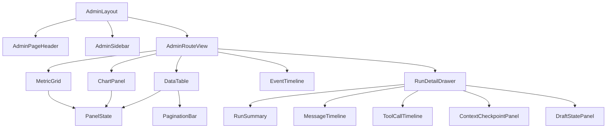

# 管理员后台前端模块设计

## 文档信息

| 字段 | 内容 |
|---|---|
| 文档类型 | 前端系统设计 |
| 当前状态 | 正式页面已实现；Web build 已通过，真实页面验收待执行 |
| 正式技术栈 | Vue 3 + TypeScript + Vite |
| 正式位置 | `Code/frontend/web/src/` |
| 临时原型 | React + Vite，仅用于视觉核验 |
| 最后核对 | 2026-08-30 |

## 一、模块目录

```text
Code/frontend/web/src/
├── app/router/
│   └── admin-routes.ts                    # 管理员路由与路由级权限
├── pages/admin/
│   ├── AdminOverviewPage.vue              # 平台总览
│   ├── AdminUsersPage.vue                 # 用户与门店
│   ├── AdminAgentRunsPage.vue             # Agent运行与详情
│   ├── AdminAgentConfigPage.vue           # 模型/工具配置
│   ├── AdminAuditPage.vue                 # 操作审计
│   └── AdminSystemPage.vue                # 系统状态
├── features/admin/
│   ├── components/                        # 指标、表格、时间线、抽屉
│   ├── composables/                       # 查询、分页、SSE/重试
│   ├── models/                            # DTO、状态与展示模型
│   └── permissions.ts                     # 菜单和动作映射
├── shared/api/
│   └── admin.ts                           # 受控 API 客户端
└── app/stores/
    └── admin-session.ts                   # 管理员会话与范围状态
```

目录是目标结构，正式开发前要先核对现有路由、Store 和共享组件，优先扩展现有资产，避免出现第二套格式化器、请求封装或权限判断。

## 二、路由与菜单

| 路由 | 页面 | 读取权限 | 写权限 |
|---|---|---|---|
| `/admin/overview` | `AdminOverviewPage` | `admin.dashboard.read` | 无 |
| `/admin/users` | `AdminUsersPage` | `admin.user.read` | `admin.user.manage` |
| `/admin/agent/runs` | `AdminAgentRunsPage` | `admin.agent.run.read` | 无 |
| `/admin/agent/config` | `AdminAgentConfigPage` | `admin.agent.config.read` | `admin.agent.config.manage` |
| `/admin/audit` | `AdminAuditPage` | `admin.audit.read` | `admin.export` 受限 |
| `/admin/system` | `AdminSystemPage` | `admin.system.read` | `admin.system.retention.manage` |

路由守卫只做快速导航控制，接口请求仍必须由服务端重新认证和授权。没有权限的菜单可以隐藏，但直接输入 URL 必须得到受控拒绝页面。

## 三、状态分层

| 状态 | 内容 | 生命周期 |
|---|---|---|
| `adminSession` | 管理员 ID、角色、权限、owner/store 范围、会话状态 | 登录、刷新、退出 |
| `overviewQuery` | 时间范围、范围筛选、指标、趋势、局部错误 | 页面进入和筛选变化 |
| `runListQuery` | 分页、排序、筛选、运行列表、总数 | 列表页生命周期 |
| `runDetailQuery` | 运行摘要、消息页、事件页、草稿、检查点 | 打开/关闭详情 |
| `panelState` | `loading`、`success`、`empty`、`error`、`blocked` | 单面板独立控制 |
| `liveStreamState` | 连接、序号、断线、重连、结束 | 运行中的详情页 |
| `mutationState` | 幂等键、提交中、成功、冲突、失败 | 配置和组织写操作 |

每个面板独立保存 `data`、`error`、`lastUpdatedAt` 和 `requestId`。请求失败时不能用旧数据伪装成当前成功结果。

## 四、组件设计



共享组件的输入和输出应使用明确 TypeScript 类型；组件不能直接拼接 URL、读取本地凭据或决定 owner/store 范围。

## 五、Agent 运行详情实现

打开一条运行记录时按三段加载：

1. 首次请求运行摘要：用户/门店、模型 ID、终态、Token、耗时、工具数和更新时间。
2. 并行请求事件、草稿和上下文摘要；消息正文按“查看内容”权限和用户动作加载。
3. 运行未结束时订阅事件；按 `sequence` 去重，断线后从最后序号补读，收到终态后关闭订阅。

工具时间线的每一项显示 `eventType`、工具名、call ID、时间、耗时、状态和脱敏摘要。计划事件与实际工具事件使用不同的标签和图标。

## 六、错误与重试

| 状态码 | 前端状态 | 页面动作 |
|---|---|---|
| `401` | `sessionExpired` | 清理管理员状态，跳转登录 |
| `403` | `forbidden` | 显示无权限原因类别，不继续请求详情 |
| `404` | `notFoundOrInvisible` | 显示资源不可见/不存在的统一提示 |
| `409` | `versionConflict` | 重新加载当前值，要求管理员再次确认 |
| `422` | `validationError` | 将字段错误定位到表单 |
| `429` | `rateLimited` | 展示等待提示，限制自动重试 |
| `5xx` | `serverError` | 面板保留局部错误和手动重试 |

AbortError 只表示用户离开页面或主动取消，不覆盖用户已经看到的取消提示。重复点击配置提交按钮不能产生两次写请求。

## 七、数据显示与安全

- 大 ID 全程使用字符串或项目已有 `EntityId` 类型，不能转换成普通 JavaScript 数字。
- Token 只展示输入、输出、总量、估算标识和统计时间，不把认证字段命名为 Token 统计。
- 对话正文、工具参数和结果默认摘要；用户主动展开时调用受保护接口并生成访问审计。
- 模型 ID 可以展示；Provider 密钥、Session Token、Cookie、密码、私钥和完整认证载荷不能进入状态、DOM、错误提示、埋点或本地存储。
- 复制摘要只能复制脱敏字段，按钮要给出成功或失败反馈。

## 八、前端验收

| 项目 | 验收条件 |
|---|---|
| 构建 | `npm run build` 成功，无类型错误 |
| 路由 | 两类角色菜单与路由守卫正确，直接访问也受控 |
| 查询 | 分页、筛选、排序、空数据和局部失败正确 |
| Agent | 工具事件按序、call ID 配对、终态和草稿状态正确 |
| 实时 | 断线可重连，重复事件不重复渲染，终态关闭连接 |
| 安全 | DOM、网络日志和本地存储无凭据；内容权限独立生效 |
| 视觉 | 遵循现有 Web 设计系统与本目录 UI 规范 |

## 对应实现

- 管理员路由：`Code/frontend/web/src/app/router/admin-routes.ts`，已由 `app/router/routes.ts` 注册
- 管理员 session：`Code/frontend/web/src/app/stores/admin-session.ts`
- 管理员 API 与 SSE：`Code/frontend/web/src/shared/api/admin.ts`、`shared/api/agent-stream.ts`
- 管理员页面：`Code/frontend/web/src/pages/admin/`
- 管理员组件和样式：`Code/frontend/web/src/features/admin/components/`、`features/admin/admin.css`
- 临时视觉原型：`Temp/grok-style-admin-preview/src/`

## 对应接口

客户端调用 `../接口设计/管理员后台接口契约设计.md` 定义的管理员 API，不复用未经管理员范围校验的普通业务接口。

## 对应测试

前端代码已有管理员页面、路由权限元数据、API 类型契约、范围筛选、局部状态和 SSE 处理；本轮尚未执行 Web build、浏览器真实登录/点击、真实 API 映射和跨范围页面测试。正式验收仍需 Vue 组件测试、API mock 契约测试、权限路由测试和事件序列测试。

## 当前限制

正式 Web 工程已创建管理员实体契约、API 路径、页面、功能模块和 `/admin/*` 路由；临时原型使用 React，只作为视觉核验依据。管理员页面依赖统一认证 token 和服务端 session，真实登录/退出、API 数据、浏览器操作、响应式和可访问性验收待执行。
