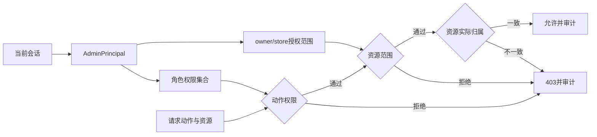
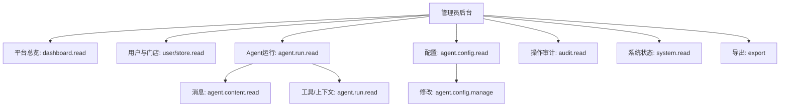

# 管理员后台权限与数据范围设计

## 文档信息

| 字段 | 内容 |
|---|---|
| 文档类型 | 权限与数据范围设计 |
| 当前状态 | 权限实现中；跨范围 HTTP 验收待执行 |
| 角色 | `SUPER_ADMIN`、`AUDIT_OBSERVER` |
| 核心原则 | 认证、动作权限、owner/store 范围、资源归属四项同时成立 |
| 最后核对 | 2026-08-30 |

## 一、权限判定模型



## 二、角色权限

| 权限域 | `SUPER_ADMIN` | `AUDIT_OBSERVER` |
|---|---:|---:|
| 平台指标和趋势读取 | 是 | 是 |
| 用户、门店、成员读取 | 是 | 是 |
| 用户状态、成员关系变更 | 是 | 否 |
| 管理员角色与范围变更 | 是 | 否 |
| Agent 运行元数据读取 | 是 | 是 |
| 对话正文读取 | 按内容授权 | 默认脱敏，按内容授权 |
| 工具名称、顺序、状态读取 | 是 | 是 |
| 工具参数/结果摘要读取 | 是 | 脱敏后 |
| Token、耗时、模型 ID 读取 | 是 | 是 |
| 模型 ID、工具配置读取 | 是 | 是 |
| 模型 ID、工具开关变更 | 是 | 否 |
| Agent 草稿确认/正式写入 | 否 | 否 |
| 管理员审计读取 | 是 | 是 |
| 导出 | 按授权 | 仅脱敏且明确授权 |
| 数据保留策略变更 | 是 | 否 |
| 系统健康读取 | 是 | 是 |

管理员后台不提供代替普通用户执行 Agent 或代替用户确认草稿的功能。后台可以查看“用户确认/拒绝/正式写入”的事实，但查看动作本身不推进业务状态。

## 三、权限命名

权限字符串采用 `admin.<resource>.<action>`：

```text
admin.dashboard.read
admin.user.read
admin.user.manage
admin.store.read
admin.store.manage
admin.permission.manage
admin.agent.run.read
admin.agent.content.read
admin.agent.config.read
admin.agent.config.manage
admin.audit.read
admin.system.read
admin.system.retention.manage
admin.export
```

权限字典由服务端维护，前端只读取可用权限并控制导航。新增权限必须同步角色矩阵、审计动作、接口测试和文档编号。

## 四、范围数据结构

```text
AdminDataScope
  allOwners: boolean
  ownerUserIds: Set<String>
  storeIds: Set<String>
  includeInactive: boolean
  contentMode: METADATA_ONLY|REDACTED|AUTHORIZED
```

超级管理员可以拥有全部 owner/store 范围，但每次请求仍应生成实际查询范围并记录。审计观察员只能使用授予的 owner/store 集合；空集合表示没有可见业务范围，不能解释为全部范围。

## 五、查询授权实现

1. 从服务端会话创建 `AdminPrincipal`，忽略客户端提交的角色字段。
2. 根据权限字典判断动作，如 `admin.agent.run.read`。
3. 将管理员范围与请求筛选条件取交集；请求没有 owner/store 时使用授权范围。
4. 对精确资源 ID，先执行带范围的资源查询；查不到时返回统一不可见结果。
5. Repository 查询明确写入 owner/store 条件；关联表也要检查归属。
6. 返回 DTO 前应用字段和长度限制，并写入读取审计。

## 六、写操作授权

| 动作 | 预检查 | 事务动作 | 完成后 |
|---|---|---|---|
| 停用用户 | 用户管理权限、范围、状态版本 | 更新状态 | 审计前后摘要、通知会话失效策略 |
| 调整成员 | 门店管理权限、owner/store、角色约束 | 更新成员关系 | 审计关系变化 |
| 修改管理员授权 | 权限管理权限、不能移除最后超级管理员 | 写授权范围 | 旧会话处理、审计 |
| 修改模型 ID | 配置权限、模型白名单、版本 | 写配置 | 刷新状态、审计 |
| 工具开关 | 配置权限、工具注册表、影响范围 | 写开关 | 运行配置版本、审计 |
| 导出 | 导出权限、字段白名单、范围 | 创建异步任务 | 下载与过期审计 |
| 保留策略 | 策略权限、参数范围 | 写策略 | 生效时间、审计 |

审计观察员所有写动作在服务端返回 403；前端不显示按钮只是减少误操作，不能替代服务端拒绝。

匿名管理员入口拒绝属于平台安全事件，不关联 owner/store，也不进入管理员业务审计查询或导出结果。该记录仅供受控的服务器日志和数据库调查使用；范围受限的 `AUDIT_OBSERVER` 不能借由匿名拒绝记录获取其他请求的 IP、路径或客户端摘要。

## 七、敏感内容访问

| 资源 | 默认模式 | 提权条件 | 记录 |
|---|---|---|---|
| 运行摘要 | `METADATA_ONLY` | 无需正文权限 | run、owner/store、时间 |
| 消息正文 | `REDACTED` | `admin.agent.content.read` + 明确查看动作 | 内容访问事件 |
| 工具参数 | `REDACTED` | 内容权限 + 字段允许 | 字段和脱敏状态 |
| 工具结果 | `REDACTED` | 内容权限 + 字段允许 | 结果摘要和访问事件 |
| 上下文摘要 | `REDACTED` | 内容权限 | 检查点 ID 和访问事件 |
| Token 数量 | `METADATA_ONLY` | 角色读权限 | 用量查询事件 |
| 模型 ID | `METADATA_ONLY` | 配置读权限 | 配置查询事件 |
| 密码/会话凭据/密钥 | 永不返回 | 无提权例外 | 任何出现都视为安全缺陷 |

## 八、页面菜单与权限



菜单可以根据权限动态展示，页面和接口必须重复校验。内容权限缺失时运行页面仍可展示元数据和 Token，但正文区域显示脱敏状态。

## 九、权限验收

| 用例 | 预期 |
|---|---|
| 普通用户访问管理员 API | 401 或 403，不返回后台数据 |
| 观察员查看授权 owner | 200，仅返回范围内结果 |
| 观察员读取未授权 store | 403/不可见，不泄露存在性 |
| 观察员提交用户状态变更 | 403，数据库无变化，产生拒绝审计 |
| 超级管理员查看全部范围 | 200，分页和每行归属正确 |
| 客户端伪造角色或 owner | 以服务端会话和授权范围为准 |
| 无正文权限打开消息 | 元数据返回，正文脱敏 |
| 配置变更后查看密钥字段 | DTO 无字段，响应和日志均无秘密 |

## 对应实现

- 管理员身份、权限和范围：`Code/backend/src/main/java/com/zhihuiji/backend/infrastructure/security/admin/AdminPrincipal.java`、`AdminPermission.java`、`AdminDataScope.java`
- 服务端授权与范围解析：`Code/backend/src/main/java/com/zhihuiji/backend/infrastructure/security/admin/AdminAuthorizationService.java`、`Code/backend/src/main/java/com/zhihuiji/backend/application/service/admin/DefaultAdminScopeService.java`
- 管理员账户/范围迁移：`Code/backend/src/main/resources/db/migration/V35__administrator_identity_and_scope.sql`
- 独立 Web 管理员 session：`Code/frontend/admin-web/src/app/stores/`

## 对应接口

权限适用于 `API-ADM-01` 至 `API-ADM-15`；当前 Controller/Service 已调用服务端权限和范围对象，接口不能自定义超出本设计的范围。

## 对应测试

已有权限单元/边界测试覆盖角色正反、owner/store 授权、资源不可见和身份解析；真实直接 URL、缓存隔离、审计失败和跨范围 HTTP 仍需执行。

## 当前限制

正式管理员角色来源和观察员范围授权已由 `admin_accounts`/`admin_scope_grants` 与 `AdminPrincipalResolver` 实现；当前复用统一认证，没有独立登录/退出接口。最后一个超级管理员保护、真实账号授予、跨范围 HTTP 和生产会话失效策略仍待确认。
