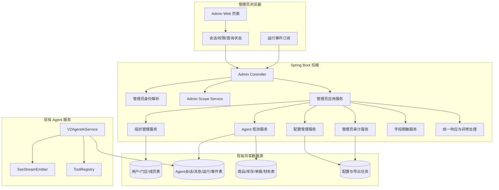
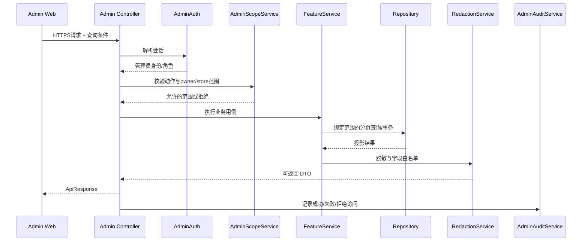

# 管理员后台总体架构

## 文档信息

| 字段 | 内容 |
|---|---|
| 文档类型 | 系统总体设计 |
| 当前状态 | 架构已落地；环境验收待执行 |
| 适用端 | 管理员 Web、管理员后端、现有 Agent 运行服务 |
| 正式前端基线 | `Code/frontend/admin-web/`，使用 Vue 3 + TypeScript + Vite |
| 正式后端基线 | `Code/backend/`，Spring Boot 分层结构 |
| 临时视觉原型 | `Temp/grok-style-admin-preview/` |
| 最后核对 | 2026-09-01 |

## 一、总体架构



管理员后台与普通业务端共享数据源和 Agent 运行记录，但使用独立的 Controller、权限范围服务和查询服务。后台查询不能直接复用一个不带管理员范围的普通用户接口，也不能让浏览器连接数据库。

## 二、模块边界

| 模块 | 责任 | 不负责 |
|---|---|---|
| Admin Web | 页面、筛选、分页、状态、图表、运行详情和重试 | 决定服务端权限、写数据库、保存密钥 |
| 管理员认证 | 解析统一会话、角色和会话有效期 | 前端本地声明管理员角色 |
| Admin Scope | 计算 owner/store 可见范围 | 修改业务数据 |
| Agent 观测 | 读取运行、消息、事件、检查点、草稿和用量 | 重新执行用户 Agent 任务 |
| 组织管理 | 读取和管理用户、门店、成员关系 | 替代普通业务流程录入 |
| 配置管理 | 模型 ID、工具开关、保留策略的校验和变更 | 返回 Provider 密钥 |
| 脱敏服务 | 按权限和字段策略处理内容 | 通过正则保证所有安全边界；关键字段须在 DTO 层排除 |
| 审计服务 | 写入登录、查看、配置、导出和拒绝事件 | 删除或篡改审计历史 |

## 三、请求处理顺序



## 四、Agent 观测边界

Agent 运行由普通用户端发起，管理员后台只读观察运行事实。观测页面需要区分：

- `plan.delta`：模型返回的计划摘要，不能显示为已执行工具。
- `tool.started`/`tool.progress`/`tool.completed`/`tool.failed`：实际执行事件。
- `answer.completed`：正式回答完成事件。
- `draft.created` 与确认/写入事件：创建类工具的业务边界。
- `context.compacted`：服务端实际生成压缩检查点后才允许显示。
- `run.completed`：运行进入终态。

管理员打开运行详情不会重新调用模型、不会继续运行循环、不会确认草稿，也不会改变原始会话。

## 五、正式目录与实际实现

管理员模块已在现有目录下实现，没有复制第二套后端应用：

```text
Code/
├── backend/src/main/java/com/zhihuiji/backend/
│   ├── api/controller/admin/
│   ├── api/dto/admin/
│   ├── application/service/admin/
│   ├── infrastructure/repository/admin/
│   └── infrastructure/security/admin/
└── frontend/admin-web/
    ├── src/app/
    ├── src/entities/admin/
    ├── src/features/
    ├── src/pages/
    └── src/shared/api/
```

后端目录已接入 Controller；独立管理员前端已接入独立路由、内存会话、页面、共享 API 客户端和图表组件。临时目录继续只保留视觉原型和规划文档，不承担正式运行链路。

## 六、部署与网络边界

- 管理员 Web 使用独立工程和独立构建产物，已发布到独立入口 `https://sxyq27.online/zhj-admin/`；店主端继续使用 `/zhj/`。
- 管理员 API 与普通 API 共用后端进程时，路由拦截器必须明确区分管理员权限和门店业务权限。
- 数据库连接使用后端已有受控数据源；管理员浏览器永不接触数据库连接信息。
- Agent 实时事件优先读取已持久化审计事件；若采用 SSE，断线后按 `lastEventId` 或序号补读，不能只依赖内存事件。
- 配置更新应在事务成功后刷新运行配置；刷新失败要有明确状态和审计，不把“写库成功”误报成“运行实例全部生效”。

## 七、当前原型与目标系统

| 层 | 当前临时原型 | 目标正式系统 |
|---|---|---|
| 页面 | React 单页静态展示 | 独立 Vue 路由、登录、总览、组织、Agent、审计和系统页面已实现 |
| 数据 | 脱敏常量数组 | 受范围过滤的 `/v2/admin/*` 客户端已接入；真实环境待验证 |
| 认证 | 无真实登录 | 统一登录与管理员 session 读取已实现，认证结果仅保留在页面内存 |
| Agent 运行 | 预置运行和事件 | 持久化事件、消息、上下文、草稿与带认证头的 SSE 客户端已实现；真实流待验证 |
| 图表 | CSS 条形图、环形图、分布条 | 语义化 SVG/DOM 统计组件已实现，提供文字摘要、空态和降级表达 |
| 操作 | 本地提示和抽屉 | 受控 API 状态、确认对话框、错误重试和版本冲突提示已实现 |
| 构建 | 临时 Vite 构建已核验 | 独立工程源码已完成，构建、接口与真实环境测试按本轮验收记录更新 |

## 对应实现

- 独立管理员 Web 工程：`Code/frontend/admin-web/`
- 正式后端管理员模块：`Code/backend/src/main/java/com/zhihuiji/backend/api/controller/admin/`、`api/dto/admin/`、`application/service/admin/`
- 管理员安全与查询：`Code/backend/src/main/java/com/zhihuiji/backend/infrastructure/security/admin/`、`infrastructure/repository/admin/`
- Agent 运行主服务：`Code/backend/src/main/java/com/zhihuiji/backend/application/service/v2/V2AgentAiService.java`
- 临时原型：`Temp/grok-style-admin-preview/`

## 对应接口

接口实际入口见 `Code/backend/src/main/java/com/zhihuiji/backend/api/controller/admin/`，契约编号见 `接口设计/管理员后台接口契约设计.md`。

## 对应测试

管理员后端接口已完成源码与契约测试，未鉴权管理员 session 的拒绝行为已核对。真实管理员带权限 API、跨 owner/store HTTP、SSE 重连、PostgreSQL 查询计划和性能验收仍需单独执行。

## 当前限制

管理员后端已在正式 `Code/` 目录接入 Controller、查询 Service/Repository、服务端身份解析和 V35-V42 数据结构。此前嵌入店主端的管理员页面已被认定为架构错误，已由 `fa14a61b` 回退；当前复用统一认证，独立管理员 Web 已实现并发布到 `https://sxyq27.online/zhj-admin/`。真实登录、带权限数据页、跨 owner/store HTTP、SSE 重连和性能验收待目标环境验证。
