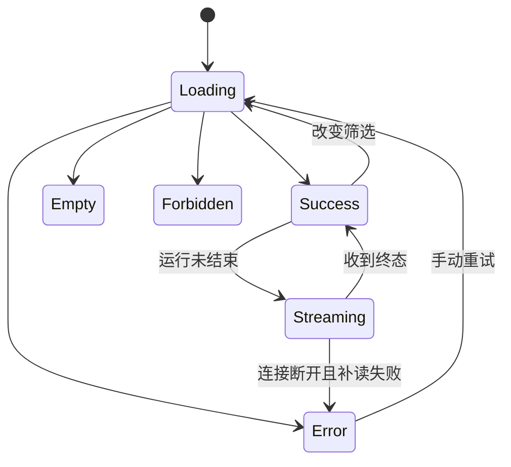

# 管理员后台前端实现计划

## 文档信息

| 字段 | 内容 |
|---|---|
| 文档类型 | 前端详细实现计划 |
| 当前状态 | 规划中 |
| 正式工程 | `Code/frontend/web/` |
| 技术栈 | Vue 3、TypeScript、Vite、项目现有共享组件 |
| 视觉基线 | `../03_系统设计/UI设计/管理员后台视觉与交互设计.md` |
| 最后核对 | 2026-08-28 |

## 一、实现顺序

| 步骤 | 实现内容 | 完成条件 |
|---|---|---|
| F1 | 管理员路由和会话读取 | 未登录/无权限均进入受控状态 |
| F2 | 侧栏、页面头部和范围筛选 | 两类角色菜单符合权限 |
| F3 | 总览指标和面板状态 | 面板独立加载、空数据和局部重试 |
| F4 | 用户、门店和成员表 | 数据库分页、状态操作和确认 |
| F5 | Agent 运行列表和详情抽屉 | run、用户、门店、Token、终态一致 |
| F6 | 消息、工具、SSE 和上下文视图 | 序号、call ID、检查点和脱敏正确 |
| F7 | 配置、审计、导出和系统页 | 高风险操作有二次确认和结果反馈 |
| F8 | 视觉、可访问性和构建 | Web build、组件和键盘测试通过 |

## 二、状态模型

每个请求状态必须绑定 `requestId`、时间和筛选条件。组件卸载时取消请求；主动取消不能被通用错误提示覆盖。

## 三、组件与数据映射

| 组件 | 数据 | 交互 |
|---|---|---|
| `AdminMetricCard` | 指标值、单位、变化、更新时间 | 查看统计说明 |
| `AdminChartPanel` | 序列、标签、空值和单位 | 更换时间范围、键盘读取摘要 |
| `AdminDataTable` | items、total、page、size | 排序、筛选、分页、空/错 |
| `RunDetailDrawer` | 运行摘要、事件、消息、草稿 | 打开、关闭、按需加载 |
| `ToolEventTimeline` | sequence、eventType、callId | 展开脱敏摘要、定位错误 |
| `ContextPanel` | 窗口、预算、检查点 | 查看压缩原因和边界 |
| `AuditEventTable` | 操作、操作者、IP、结果 | 详情、筛选、导出 |
| `MutationConfirmDialog` | 影响范围、旧值、新值、原因 | 二次确认或取消 |

## 四、Agent 事件处理

1. 详情页先加载持久化事件列表，按 `sequence` 排序。
2. 运行未结束时建立事件流，并从最后序号补读。
3. 以 `eventId` 和 `sequence` 去重，重复事件不重复渲染。
4. 收到终态后关闭事件流，保留最终状态。
5. 事件缺失或乱序时显示完整性提示，不自行补写事件。
6. 事件内容由后端脱敏，前端不执行正则清除来承担安全边界。

## 五、前端安全实现

- 路由、按钮和接口均使用权限字典；按钮隐藏不替代服务端拒绝。
- owner/store 筛选只作为查询条件，不能让用户修改会话范围。
- 复制、导出和正文展开均由后端返回已授权字段。
- 不在 localStorage、URL、错误栈或埋点中写入 Cookie、Session Token、密码或模型密钥。
- 采用项目已有的大 ID 解析工具，不使用普通数字转换。

## 六、交付检查

| 检查 | 命令/证据 | 结果要求 |
|---|---|---|
| 类型与构建 | `npm run build` | 成功 |
| 组件状态 | 组件测试 | 成功/明确阻塞 |
| API 契约 | mock/集成测试 | 字段和错误一致 |
| 权限路由 | 角色测试 | 两类角色隔离 |
| 事件流 | 序列测试 | 去重、补读、终态正确 |
| 视觉 | 静态核验 | 遵循设计文档 |

## 对应实现

- 正式 Web 入口：`Code/frontend/web/src/main.ts`
- 正式路由：`Code/frontend/web/src/app/router/`
- 正式会话：`Code/frontend/web/src/app/stores/session.ts`
- 临时原型：`../../../Temp/grok-style-admin-preview/src/`

## 对应接口

使用 `../03_系统设计/接口设计/管理员后台接口契约设计.md` 中的 `API-ADM` 接口。

## 对应测试

前端测试计划位于 `../05_测试与验收/功能测试/管理员后台功能测试计划.md`。

## 当前限制

当前临时原型是 React；正式实现必须落在现有 Vue Web 工程，不能把原型构建结果当作正式页面交付。
