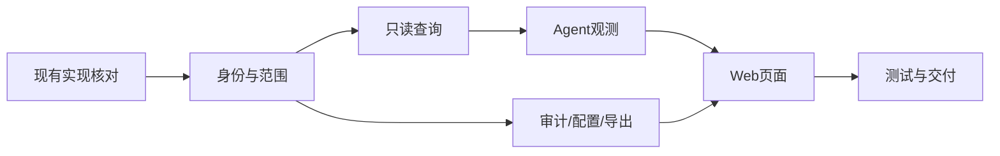

# 管理员后台实现索引

## 文档信息

| 字段 | 内容 |
|---|---|
| 文档类型 | 详细设计与实现索引 |
| 当前状态 | 实现索引已更新；环境验收待执行 |
| 正式前端 | `Code/frontend/web/` |
| 正式后端 | `Code/backend/` |
| 实现范围 | 管理员 Web、管理员 API、数据查询、审计和配置 |
| 最后核对 | 2026-08-30 |

## 一、实现阶段

| 阶段 | 内容 | 依赖 | 交付物 | 状态 |
|---|---|---|---|---|
| I0 | 现有认证、角色、门店和 Agent 数据核对 | 当前源码 | 字段与调用链确认 | 已完成（源码核对） |
| I1 | 管理员身份、角色和范围 | I0 | principal、权限字典、范围服务 | 已完成（源码/单元测试） |
| I2 | 总览、组织和运行只读查询 | I1 | Controller、DTO、分页 Query | 已完成（源码/契约测试） |
| I3 | Agent 事件、消息、Token 和上下文 | I2 | 观测服务、投影、脱敏 | 已完成（源码/契约测试） |
| I4 | 管理员审计、配置和导出 | I1–I3 | 事务写服务、任务和审计 | 已完成（源码/契约测试） |
| I5 | Vue 管理员页面 | I2–I4 | 路由、页面、组件和状态 | 已创建（Web build 已通过） |
| I6 | 测试、性能验证和发布准备 | I1–I5 | 测试报告、查询计划、交付清单 | 部分完成（环境项待执行） |

## 二、文件与需求映射

| 目标文件/目录 | 负责内容 | 需求编号 |
|---|---|---|
| `api/controller/admin/` | 管理员 API 入口 | `SR-ADM-01`–`12` |
| `api/dto/admin/` | 请求/响应字段和脱敏 DTO | `API-ADM-01`–`15` |
| `application/service/admin/AdminScopeService.java` | owner/store 范围 | `SR-ADM-02` |
| `application/service/admin/AdminAgentObservabilityService.java` | 运行、事件、消息、草稿、上下文 | `SR-ADM-05`–`08` |
| `application/service/admin/AdminUsageService.java` | Token、耗时和延迟 | `SR-ADM-06` |
| `application/service/admin/AdminAuditService.java` | 登录、访问、拒绝、变更 | `SR-ADM-10` |
| `infrastructure/repository/admin/` | 分页、聚合、投影和范围查询 | `SR-ADM-03`–`13` |
| `pages/admin/` | 管理员页面 | `BR-F01`–`16` |
| `features/admin/` | 组件、权限、SSE 和状态 | `SR-ADM-02`–`14` |
| `db/migration/V*__admin_*`（必要时） | 新表、新字段和索引 | `SR-ADM-04`、`09`、`10`、`12` |

## 三、实现原则

- 优先复用正式工程已有的响应、异常、权限、分页、格式化和 API 客户端资产。
- 管理员查询使用投影 DTO，禁止直接序列化 JPA 实体和内部事件 JSON。
- 读接口与写接口分开；读接口不能触发 Agent、草稿确认或业务写入。
- 每个写操作同时校验角色、范围、版本、幂等键和审计策略。
- 新增数据库结构前先确认现有表是否已经提供同一事实，避免重复存储。

## 四、当前已有可复用代码

| 组件 | 位置 | 复用方式 |
|---|---|---|
| 统一响应 | `Code/backend/src/main/java/com/zhihuiji/backend/api/common/ApiResponse.java` | 管理员 Controller 返回统一结构 |
| 统一异常 | `.../GlobalExceptionHandler.java` | 不在 Controller 重复映射 |
| 分页 | `.../PaginationUtils.java` | 兼容现有 page/size 规则 |
| owner 服务 | `.../CurrentOwnerService.java` | 作为业务范围参考，管理员需独立范围对象 |
| 门店访问策略 | `.../StoreAccessPolicy.java` | 复用关系校验思想 |
| Agent 审计 | `.../agent/component/RunAuditService.java` | 读取运行证据和事件质量 |
| Web 会话 | `Code/frontend/web/src/app/stores/session.ts` | 参考会话持久化和权限状态 |

## 五、实现状态记录

| 项目 | 当前状态 | 证据 |
|---|---|---|
| 临时视觉原型 | 已完成 | `../../../Temp/grok-style-admin-preview/design-qa.md` |
| 正式管理员前端目录 | 已创建 | `Code/frontend/web/src/entities/admin/`、`features/admin/`、`pages/admin/`、`app/router/admin-routes.ts` 和管理员 API 客户端已存在，真实数据/浏览器验收待执行 |
| 正式管理员后端目录 | 已实现 | `Code/backend/src/main/java/com/zhihuiji/backend/{api/dto/admin,application/service/admin,infrastructure/security/admin,infrastructure/repository/admin,api/controller/admin}` 已包含 Controller、Service、Repository 和 DTO |
| 管理员专用审计存储 | 已实现 | `AdminAuditEventEntity`、`AdminAuditService`、V37 迁移及审计测试 |
| Agent actor/store 运行关联 | 已实现（历史可空） | V36 字段与索引；历史无可靠来源时返回空值 |
| 接口和权限契约 | 已实现 | `02_`、`03_` 文档与 `/v2/admin/*` Controller 已同步 |

## 对应实现

本文件索引的实现代码位于正式项目 `Code/`；临时文档目录不创建源码。

## 对应接口

接口设计见 `../03_系统设计/接口设计/管理员后台接口契约设计.md`。

## 对应测试

测试分阶段见 `../05_测试与验收/管理员后台测试总览.md`。

## 当前限制

管理员后端源码、V35-V40 迁移、管理员 Web 页面/路由已创建；管理员测试命令和 Web build 已通过。真实 HTTP 登录/退出、跨范围数据集、SSE 重连、PostgreSQL 计划、性能实测和正式发布仍待执行。
