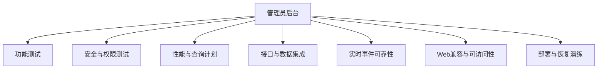

# 管理员后台测试总览

## 文档信息

| 字段 | 内容 |
|---|---|
| 文档类型 | 测试与验收总览 |
| 当前状态 | 静态与单元验证已完成；正式验收待执行 |
| 适用端 | 管理员 Web、管理员 API、数据库查询和 Agent 观测 |
| 测试前缀 | `TEST-ADM` |
| 证据目录 | 正式实现后建议使用 `testing/.artifacts/<日期>-admin-<wave>/` |
| 最后核对 | 2026-08-30 |

## 一、测试范围

| 类型 | 验证内容 | 当前状态 |
|---|---|---|
| 功能 | 登录 session、总览、组织、Agent、配置、审计和导出 | 部分完成：源码/契约测试通过，真实 HTTP 待执行 |
| 安全 | 未登录、角色、owner/store、内容脱敏、导出和注入输入 | 部分完成：权限源码测试通过，真实安全环境待执行 |
| 性能 | 分页、聚合、详情、事件流、并发和资源 | 未执行：目标 PostgreSQL/负载环境待准备 |
| 接口/数据集成 | DTO、数据库映射、迁移、关联和空值 | 部分完成：Controller/Service 契约测试通过，数据库集成待执行 |
| 可靠性 | SSE 断线、重复事件、服务局部失败、审计失败 | 部分完成：SSE 服务契约通过，真实断线/故障待执行 |
| 兼容与可访问性 | 桌面/窄屏、键盘、焦点、状态文字和语义表格 | 原型已核验；正式 Web 待执行 |
| 部署恢复 | 配置刷新、导出清理、服务重启和数据恢复边界 | 延期 |

## 二、统一测试记录

每条记录至少包含：

| 字段 | 内容 |
|---|---|
| `test_id` | 唯一用例号，如 `TEST-ADM-F01` |
| `category_id` | 功能/安全/性能/集成/可靠性分类 |
| `wave_id` | 环境基线、夹具、长链路或发布验收批次 |
| `env` | 本地、测试环境或目标环境；不混写 |
| `account_scope` | 账号角色与脱敏的 owner/store 范围 |
| `pre_state` | 测试前数据、配置和会话状态 |
| `actions` | 请求、页面动作和操作顺序 |
| `expected` | 状态码、字段、数据库和审计预期 |
| `actual` | 实际响应、耗时、数据变化和错误 |
| `artifacts` | 原始响应、事件、截图、命令输出路径 |
| `cleanup` | 测试数据、导出文件、会话和配置清理 |
| `result` | `已完成`、`未完成`、`阻塞`、`延期` |

## 三、验收门槛

| 门槛 | 通过条件 |
|---|---|
| 角色隔离 | 两类角色的正反权限和跨范围测试有证据 |
| 数据正确 | 列表、详情、统计、事件、草稿和关联字段一致 |
| Agent 观测 | 目标工具、实际事件、正式回答、终态和审计可追踪 |
| 安全 | 未认证/越权/敏感字段/导出测试无未处理缺陷 |
| 性能 | 设计目标有真实环境测量；没有 PostgreSQL 时查询计划记为阻塞/延期 |
| 可靠性 | 断线、重复、乱序、局部失败和审计失败行为明确 |
| 发布 | Web build、后端测试、迁移测试和必要的恢复检查有证据 |

## 四、原型与正式系统的区分

当前 `Temp/grok-style-admin-preview` 只可执行静态页面、构建和交互核验。它可以证明导航、面板、抽屉、图表表达和响应式布局，不可以证明真实登录、管理员授权、数据库分页、Agent SSE、Token 统计或审计写入。

## 对应实现

- 原型 QA：`../../../Temp/grok-style-admin-preview/design-qa.md`
- 正式测试目录：`testing/`
- 正式后端测试：`Code/backend/src/test/`
- 管理员测试命令：`./Code/backend/gradlew -p Code/backend test --tests '*admin.*' --no-parallel --rerun-tasks --no-daemon`（2026-08-30，`BUILD SUCCESSFUL`）；发布构建命令 `./Code/backend/gradlew -p Code/backend test bootJar --no-daemon` 同样通过。
- 相关回归：`V2BillDomainControllerTest` 5 项、`AdminControllerTest` 7 项和全仓 703 项均通过；`AdminControllerTest` 使用独立内存 H2，避免 local 文件库写入冲突。

## 对应接口

目标接口：`../03_系统设计/接口设计/管理员后台接口契约设计.md`。

## 对应测试

- 功能：`功能测试/管理员后台功能测试计划.md`
- 安全：`安全测试/管理员后台安全测试计划.md`
- 性能：`性能测试/管理员后台性能测试计划.md`
- 集成：`集成验收/管理员后台接口与数据库测试计划.md`、`集成验收/管理员后台可靠性与跨层验收计划.md`

## 当前限制

管理员 Controller、Service、权限、SSE、配置、导出、保留策略和相关契约测试已有源码证据；目标环境已完成基础部署、V33-V40 迁移和未授权 HTTP 检查，V41 的匿名拒绝审计测试已通过但尚未发布。真实管理员登录/退出、跨 owner/store HTTP、PostgreSQL EXPLAIN、性能负载、SSE 重连和恢复演练仍未执行，不能据此宣称正式验收通过。
