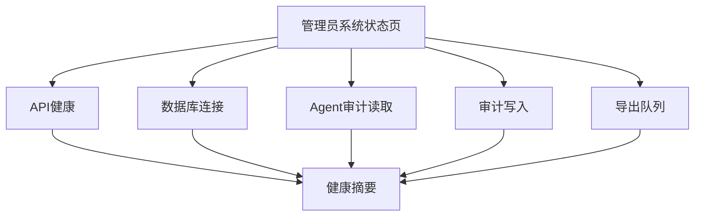

# 管理员后台运行监控

## 文档信息

| 字段 | 内容 |
|---|---|
| 文档类型 | 运行监控设计 |
| 当前状态 | 监控接口已实现；指标与告警实测待执行 |
| 适用端 | 管理员 Web、API、数据库、Agent 观测服务 |
| 监控目标 | 可用性、延迟、范围拒绝、审计完整性和事件质量 |
| 最后核对 | 2026-08-30 |

## 一、监控指标

| 指标 | 维度 | 关注点 |
|---|---|---|
| 管理员 API 请求量 | route、method、role、status | 使用量和错误率 |
| API p50/p95/p99 | route、status | 慢接口和异常尖峰 |
| 数据库查询耗时 | queryName、operation | 全量读取、慢查询和索引问题 |
| 范围拒绝数量 | role、resource、reason | 越权尝试和权限配置问题 |
| Agent 详情事件缺口 | run、eventType | 工具事件、终态和消息不完整 |
| Token 估算比例 | modelId、时间 | Provider 用量字段缺失 |
| 审计写入失败 | action、resource | 关键证据可靠性 |
| SSE 连接与重连 | route、status | 实时观测稳定性 |
| 导出任务状态 | type、status | 队列积压、失败和过期清理 |
| 面板局部失败 | panel、reason | 前端降级和下游健康 |

## 二、健康检查

健康检查只返回 `UP`、`DEGRADED`、`DOWN`、`UNKNOWN` 和错误类别。它不返回密码、连接串、内部堆栈或 Provider 密钥。

## 三、告警阈值

以下为初始设计阈值，正式环境需结合容量测试校准：

| 告警 | 初始条件 | 响应 |
|---|---|---|
| API 5xx | 5 分钟比例超过 1% | 查看 request ID、下游状态和近期发布 |
| API 延迟 | p95 连续超过接口目标 3 个窗口 | 查看 Repository 和连接池 |
| 范围拒绝突增 | 短时超过基线多倍 | 核查账号、IP 和授权范围 |
| 审计写入失败 | 连续失败或积压 | 暂停高风险写操作并处理存储 |
| 事件缺失 | run 事件配对失败 | 核查 Agent 审计写入和事件流 |
| Token 估算异常 | 估算比例超过预设阈值 | 检查 Provider 用量映射 |
| 导出积压 | 队列超过容量或文件未清理 | 限制新任务并清理过期文件 |

## 四、监控数据安全

- 指标标签不能包含完整用户消息、工具参数、Cookie、Session Token 或模型密钥。
- 日志只记录 request ID、run ID、资源类型、状态和耗时等必要字段。
- 运行内容和审计正文按内容权限存储与查看，不在监控标签中重复保存。
- 监控查看也属于管理员读取动作，按权限和审计规则处理。

## 五、监控验收

| 项目 | 条件 |
|---|---|
| 指标 | 关键接口、数据库、SSE、审计和导出都有指标 |
| 告警 | 可通过测试故障触发并定位到 request/run ID |
| 脱敏 | 指标、日志和健康响应没有秘密字段 |
| 局部故障 | 单个面板或下游异常不会伪装成全局成功 |
| 恢复 | 故障恢复后指标、事件和审计状态收敛 |

## 对应实现

- Agent 运行审计：`Code/backend/src/main/java/com/zhihuiji/backend/application/service/v2/agent/component/`
- 管理员观测与健康接口：`Code/backend/src/main/java/com/zhihuiji/backend/application/service/admin/AdminAgentDetailService.java`、`AdminSystemService.java`
- 管理员事件流：`Code/backend/src/main/java/com/zhihuiji/backend/application/service/admin/AdminAgentEventStreamService.java`
- 后台原型日志：`Temp/grok-style-admin-preview/src/App.jsx`

## 对应接口

主要覆盖 `API-ADM-02`、`05`、`07`、`08`、`12`、`13`、`14`。

## 对应测试

监控触发和故障注入计划见 `../05_测试与验收/集成验收/管理员后台可靠性与跨层验收计划.md`。

## 当前限制

管理员健康 API 和事件/审计读取代码已存在；当前没有目标环境指标采集、告警系统和真实负载，阈值尚未校准，无法宣称监控验收通过。
