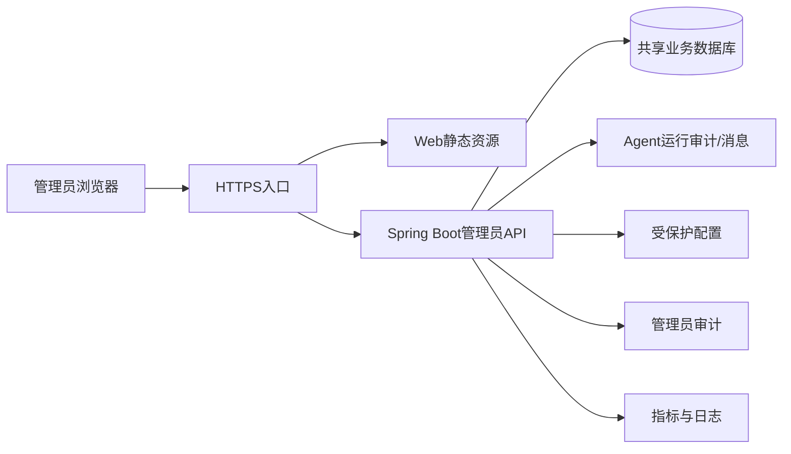

# 管理员后台部署边界

## 文档信息

| 字段 | 内容 |
|---|---|
| 文档类型 | 部署与环境边界 |
| 当前状态 | 后端 API 已部署；独立 Web 工程待实现和发布 |
| 适用端 | 管理员 Web、管理员后端、数据库 |
| 正式工程 | `Code/` |
| 当前原型 | `Temp/grok-style-admin-preview/` |
| 最后核对 | 2026-08-30 |

## 一、环境矩阵

| 环境 | 用途 | 数据 | 允许动作 | 当前状态 |
|---|---|---|---|---|
| 本地原型 | 视觉、交互和构建核验 | 脱敏静态数据 | 页面开发、构建 | 已完成（原型范围） |
| 本地后端 | Controller、Service、Repository 测试 | 测试数据库 | 自动化测试和迁移验证 | 管理员源码/契约测试已完成 |
| 集成环境 | 跨层、SSE、权限和性能 | 专用测试数据 | 集成验收 | 待执行 |
| 目标环境 | 运行和查询计划核对 | 经过批准的数据 | 只读验证和发布验收 | 后端已部署；独立 Web 未发布 |
| 生产环境 | 正式运营 | 生产数据 | 需独立发布授权 | 后端基础发布完成；独立 Web 待批准 |

## 二、部署结构

浏览器只访问 HTTPS 页面和 API。数据库、配置和日志系统位于服务端网络边界内；管理员页面不显示连接字符串、密钥或内部网络地址。

## 三、发布顺序

1. 核对代码版本、数据库 migration 版本、接口契约和需求追踪矩阵。
2. 在非生产环境执行构建、单元、集成、安全和迁移测试。
3. 对管理员角色、范围、审计、敏感字段和回滚路径进行审批。
4. 先发布后端兼容接口，再发布 Web 页面；页面要能处理旧接口或明确阻塞。
5. 发布后检查登录、总览、运行详情、审计和系统健康，不执行真实高风险变更。
6. 保留版本、配置变更、测试证据和监控窗口，异常时按恢复文档处理。

本项目的后端运行在 `8.220.206.9` 的 `sxyq27-zhj-api:20260830T183500-admin-usage-f8361754`，数据库当前为 Flyway V41。`https://sxyq27.online/zhj/` 是店主端，不承载管理员页面；独立管理员 Web 计划使用 `https://sxyq27.online/zhj-admin/`，尚未部署。

## 四、配置边界

| 配置 | 页面是否可见 | 页面是否可改 | 说明 |
|---|---:|---:|---|
| 模型 ID | 是 | 超级管理员 | 需要白名单、版本和审计 |
| 工具启用状态 | 是 | 超级管理员 | 需要工具注册表和影响范围 |
| Token 统计口径 | 是 | 否或受控 | 统计规则由服务端决定 |
| Provider 地址 | 只显示非敏感标识 | 否 | 不显示完整连接配置 |
| Provider 密钥 | 否 | 否 | 只在受保护运行配置中使用 |
| 数据库连接信息 | 否 | 否 | 不进入后台 |
| 审计保留策略 | 是 | 超级管理员 | 二次确认并审计 |

## 五、发布与恢复边界

- 本临时目录不参与生产发布、生产迁移、容器操作或 `git push`。
- 正式发布必须使用已审批的构建产物和环境配置，不能从临时原型直接复制。
- 数据库迁移必须先验证已有数据和索引；失败时按数据库恢复流程处理。
- 恢复操作只由有权限的运维人员执行，后台页面不提供数据库恢复按钮。

## 对应实现

- Web 工程：`Code/frontend/admin-web/`
- 后端工程：`Code/backend/`
- 迁移：`Code/backend/src/main/resources/db/migration/`
- 当前原型：`Temp/grok-style-admin-preview/`

## 对应接口

部署完成后核对 `API-ADM-01` 至 `API-ADM-15`；当前代码入口位于 `Code/backend/src/main/java/com/zhihuiji/backend/api/controller/admin/`。

## 对应测试

部署前测试见 `../05_测试与验收/`；生产查询计划和真实部署状态必须单独记录，不能用本地原型结果替代。

## 当前限制

管理员 API 和 V33-V41 迁移已在目标服务器完成发布，基础 HTTP、Nginx、Flyway、真实管理员登录和核心只读 API 已核对。店主端内的历史管理员页面将回退，独立管理员 Web 仍未发布；跨 owner/store 页面、性能、SSE 重连、故障恢复和高风险操作验收仍待安排。
