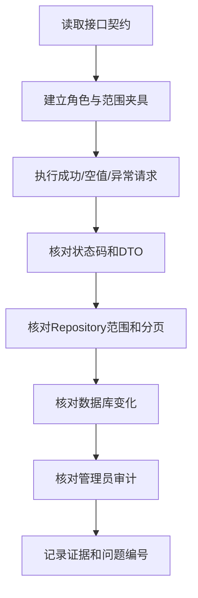

# 管理员后台接口审计

## 文档信息

| 字段 | 内容 |
|---|---|
| 文档类型 | 接口风险审计 |
| 当前状态 | 源码审计已更新；真实 HTTP 审计待执行 |
| 适用端 | 管理员 API 与前端 API 客户端 |
| 审计范围 | `API-ADM-01`–`API-ADM-15` |
| 最后核对 | 2026-08-30 |

## 一、接口审计矩阵

| 接口 | 主要风险 | 必查项 | 当前结论 |
|---|---|---|---|
| `API-ADM-01` | 会话伪造、角色伪造 | 服务端身份、过期、退出、范围 | 部分完成：session/角色/范围源码已实现，独立退出和真实 HTTP 待验证 |
| `API-ADM-02` | 聚合越界、全量扫描 | 时间、范围、统计口径、分页/缓存 | 源码已实现；PostgreSQL 计划和真实数据待验证 |
| `API-ADM-03` | 用户状态越权 | 角色、范围、版本、幂等、审计 | 源码已实现；真实 HTTP/最后管理员规则待验证 |
| `API-ADM-04` | 成员关系破坏 | owner/store/user 约束、最后店长规则 | 源码已实现；真实跨范围 HTTP 待验证 |
| `API-ADM-05` | 运行 ID 猜测 | 范围查询、字段脱敏、稳定分页 | 源码已实现；真实数据和 HTTP 待验证 |
| `API-ADM-06` | 正文泄露 | 内容权限、分页、大字段限制 | 源码已实现；真实内容权限扫描待验证 |
| `API-ADM-07` | 工具事件伪造/乱序 | call ID、sequence、持久化补读 | 源码已实现；真实断线/乱序 HTTP 待验证 |
| `API-ADM-08` | Token 统计误导 | 精确/估算来源、时间和模型维度 | 源码已实现；Provider 累计用量语义和实测待确认 |
| `API-ADM-09` | 检查点泄露 | owner/conversation、摘要脱敏 | 源码已实现；真实跨范围内容验证待执行 |
| `API-ADM-10` | 草稿状态误读 | 只读、确认人与正式写入关联 | 源码已实现；真实确认失败和业务链待验证 |
| `API-ADM-11` | 配置误改 | 模型/工具白名单、版本、幂等 | 源码已实现；真实配置刷新待验证 |
| `API-ADM-12` | 审计查询越权 | 访问自身也审计、范围、字段 | 源码已实现；真实审计查询待验证 |
| `API-ADM-13` | 健康信息泄露 | 连接信息、堆栈和 Provider 字段 | 源码已实现；目标环境健康和敏感扫描待验证 |
| `API-ADM-14` | 导出泄露和重复下载 | 字段白名单、短期文件、下载审计 | 源码已实现；真实文件清理待验证 |
| `API-ADM-15` | 保留策略误改 | 权限、范围、二次确认、审计 | 源码已实现；生产保留周期待确认 |

## 二、接口审计步骤

## 三、禁止的接口行为

- 把前端传入的角色、owner 或 store 直接当作授权结论。
- 返回实体对象、原始事件 JSON、完整对话正文或未限制长度的工具结果。
- 以 HTTP 200 表示查询失败、审计失败、工具失败或草稿未确认。
- 由管理员查看接口调用 Agent、确认草稿或写入普通业务表。
- 在错误消息、日志或下载文件中返回凭据和完整认证载荷。

## 对应实现

- 统一响应：`Code/backend/src/main/java/com/zhihuiji/backend/api/common/ApiResponse.java`
- 管理员后端 API：`Code/backend/src/main/java/com/zhihuiji/backend/api/controller/admin/`
- 管理员权限/审计：`Code/backend/src/main/java/com/zhihuiji/backend/infrastructure/security/admin/`、`application/service/admin/`
- 目标契约：`../03_系统设计/接口设计/管理员后台接口契约设计.md`

## 对应接口

本文件覆盖全部 `API-ADM` 接口。

## 对应测试

接口测试计划：`../05_测试与验收/集成验收/管理员后台接口与数据库测试计划.md`、`../05_测试与验收/安全测试/管理员后台安全测试计划.md`。

## 当前限制

管理员 Controller、DTO、Service、Repository 和权限/审计代码已存在，管理员源码/契约测试已通过。当前缺少真实 HTTP 登录/退出、跨范围数据集、PostgreSQL 计划、SSE 重连和目标环境请求证据。
