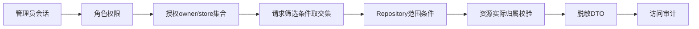

# 管理员后台数据隔离审计

## 文档信息

| 字段 | 内容 |
|---|---|
| 文档类型 | 数据隔离审计 |
| 当前状态 | 范围实现已核对；跨范围 HTTP 审计待执行 |
| 适用端 | 管理员 API、Repository、现有共享数据库 |
| 审计对象 | owner、store、用户、Agent 运行和业务关联 |
| 最后核对 | 2026-08-30 |

## 一、隔离链路

## 二、审计检查表

| 检查项 | 证据 | 目标 |
|---|---|---|
| 用户列表带 owner 条件 | `AdminUserQueryRepository`、`AdminOrganizationService` | 不返回范围外用户 |
| 门店成员校验 owner/store/user | `AdminOrganizationService` 与 `AdminStoreQueryRepository` | 关系不能跨 owner |
| 运行查询带 owner/store | `AdminAgentQueryRepository`、`AdminAgentObservabilityService` | run ID 猜测不能越权 |
| 消息通过 conversation 归属校验 | `AdminAgentDetailService` | 不能只校验消息 ID |
| 事件通过 run 归属校验 | `AdminAgentDetailService`、`AdminAgentEventQueryRepository` | 事件不能脱离运行范围读取 |
| 草稿通过 conversation/owner 校验 | Service | 观察不改变草稿 |
| 检查点带 owner/conversation | Repository | 摘要不能跨会话读取 |
| 聚合按授权范围计算 | `AdminOverviewService`、`AdminAgentDetailService` | 总数和 Token 不含越权数据 |
| 缓存带范围键 | 缓存设计 | 不能跨范围复用响应 |
| 导出带范围和字段白名单 | `AdminExportService`、V39 范围快照 | 文件不能超出授权 |

## 三、当前已知缺口

V36 已为正式 Agent 运行审计结构增加可为空的 `store_id` 和 `actor_user_id` 及索引。历史运行没有可靠来源时仍返回空值，管理员后台不能把会话所属 owner 推断为实际发起用户或门店。

现有普通业务 Repository 的 owner 隔离模式可以作为参考，但管理员全量查询需要独立的授权范围对象，不能直接复用“当前 owner”语义。

## 四、跨范围测试

至少建立两个 owner、每个 owner 两个 store、每个 store 一个店长和多个店员，再准备运行、消息、事件、草稿和统计数据。用例需要交叉替换请求中的 owner/store/run/message/event ID，断言：

- 读取结果为空或返回受控拒绝。
- 不返回资源存在性、名称或统计数量的差异信息。
- 审计记录包含拒绝原因和请求范围。
- 数据库无越权写入和无意修改。

## 对应实现

- 现有隔离参考：`Code/backend/src/main/java/com/zhihuiji/backend/application/service/store/`
- 管理员身份/范围迁移：`Code/backend/src/main/resources/db/migration/V35__administrator_identity_and_scope.sql`
- Agent 运行关联迁移：`Code/backend/src/main/resources/db/migration/V36__agent_run_actor_store_scope.sql`
- 管理员查询与授权：`Code/backend/src/main/java/com/zhihuiji/backend/application/service/admin/`、`infrastructure/repository/admin/`
- 现有 owner 基础迁移：`Code/backend/src/main/resources/db/migration/V7__owner_scope_foundation.sql`

## 对应接口

覆盖 `API-ADM-02` 至 `API-ADM-15` 的所有范围相关请求。

## 对应测试

源码权限和范围测试已通过；详细安全和接口测试见 `../05_测试与验收/安全测试/管理员后台安全测试计划.md`。真实跨 owner/store HTTP、数据库数据集和缓存隔离仍待执行。

## 当前限制

管理员授权范围对象和 Repository 过滤已实现并有源码测试；真实跨 owner/store 数据集、HTTP 响应、PostgreSQL 查询计划和目标缓存配置尚未验证。
