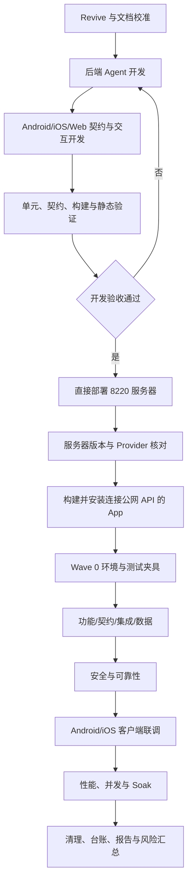

# Agent 开发与真实测试执行步骤（临时）

更新时间：2026-09-01

| 字段 | 内容 |
|---|---|
| 文档状态 | 临时执行编排，开发与真实测试尚未由本文件宣告完成 |
| 适用范围 | 后端 Agent、Web Agent 协议、Android/iOS 客户端、真实服务器、模拟器与测试证据 |
| 总原则 | 先完成开发和自动化验证，再部署服务器，最后通过真实 App 执行功能、安全、可靠性、集成和性能测试 |
| 真实服务 | `https://zhj-api.sxyq27.online/`，目标节点为 8220（`8.220.206.9`） |
| 当前模型配置 | 源码默认 `glm-5.3-flash`；运行时实际值必须在 Wave 0 重新核对 |
| 上下文窗口 | 源码配置上限 `272000` tokens；Provider 实际窗口必须在 Wave 0 记录 |
| 状态值 | 只使用 `Passed`、`Failed`、`Blocked`、`Deferred` |

本文件用于安排后续执行顺序、文档入口、输入、观察点和验收条件。它不产生测试通过结论；真实结果必须写入对应类别台账和证据目录。

## 一、文档索引与阅读顺序

按下面顺序阅读。前四项确定当前代码和执行规则，后续分类计划确定具体用例，项目文档用于确认业务、设计和部署边界。

| 顺序 | 文档 | 用途 | 本轮处理 |
|---:|---|---|---|
| 1 | [Agent 测试总览](README.md) | 唯一入口、状态、证据和维护规则 | 增加本文件入口 |
| 2 | [Agent 代码事实基线](代码事实基线.md) | 工具、调用链、SSE、终态、预算、配置和数据表 | 修正模型与窗口事实 |
| 3 | [Agent 映射台账](映射台账.md) | 工具、功能、类别和编号映射 | 修正类别用例数量 |
| 4 | [Agent 开发与优化计划](../../docs/04_详细设计与实现/Agent三要素与上下文压缩优化执行计划.md) | 编排循环、工具门、草稿、上下文、记忆、搜索和跨端目标 | 同步为“代码阶段进行中，真实验证待执行” |
| 5 | [Agent 实现索引](../../docs/04_详细设计与实现/Agent实现索引.md) | 各端源码入口和实现状态 | 删除“已验证”的过度表述 |
| 6 | [功能测试计划](功能/TEST_PLAN.md) | 61 个工具、会话、Loop、SSE、草稿、结果块和扩展功能 | 开发完成后按此执行 |
| 7 | [安全测试计划](安全/TEST_PLAN.md) | 认证、权限、owner/store、IDOR、注入、SSRF、脱敏和确认重放 | 开发完成后按此执行 |
| 8 | [契约测试计划](契约/TEST_PLAN.md) | 24 个 REST 端点、SSE、错误包络和跨端序列化 | 自动化阶段先执行 |
| 9 | [单元测试计划](单元/TEST_PLAN.md) | 后端、Android、iOS Agent 组件和缺口 | 开发阶段同步补测 |
| 10 | [集成测试计划](集成/TEST_PLAN.md) | Provider、数据库、Repository、事务和全链路 | 服务器或隔离服务就绪后执行 |
| 11 | [可靠性测试计划](可靠性/TEST_PLAN.md) | 超时、429、空响应、断线、取消、重连、重复事件和资源释放 | 故障注入后执行 |
| 12 | [数据一致性测试计划](数据/TEST_PLAN.md) | 草稿、正式表、幂等、检查点、记忆和清理 | 每个写入场景必须执行 |
| 13 | [性能测试计划](性能/TEST_PLAN.md) | 时延、并发、Loop、压缩、长会话、Soak 和资源 | 功能与安全核心路径稳定后执行 |
| 14 | [客户端联调计划](客户端/TEST_PLAN.md) | Android/iOS 真实展示和 Web 协议对照 | 服务器与 App 版本一致后执行 |
| 15 | [Agent 系统需求](../../docs/02_业务系统需求/Agent对话系统需求.md) | 业务目标、接口和跨端需求 | 发现契约冲突时回查 |
| 16 | [Agent 总体架构](../../docs/03_系统设计/Agent系统设计/Agent总体架构.md) | 主链、事件和组件职责 | 核对实现是否越界 |
| 17 | [工具选择与执行设计](../../docs/03_系统设计/Agent系统设计/工具选择与执行设计.md) | 工具选择、依赖、权限和执行门 | 核对目标工具和额外工具 |
| 18 | [草稿与确认设计](../../docs/03_系统设计/Agent系统设计/草稿与确认设计.md) | 创建类工具的草稿和二次授权 | 核对确认前后写入边界 |
| 19 | [对话生命周期设计](../../docs/03_系统设计/Agent系统设计/对话生命周期设计.md) | 会话、消息、运行、取消和恢复 | 核对显式 conversation_id 续聊 |
| 20 | [Provider 维护说明](../../docs/06_部署与运维/Provider维护说明.md) | 模型、URL、Wire API、Key 注入和探针 | 修正默认模型并保留运行时核对 |

## 二、已发现的文档差异与修正

| 文档 | 已发现差异 | 修正方式 | 当前结论 |
|---|---|---|---|
| `testing/Agent/README.md` | 缺少本轮开发先行、真实测试后置的统一入口 | 增加本文件链接和执行说明 | 本轮同步 |
| `testing/Agent/代码事实基线.md` | 上下文上限写为 `32768`，默认模型写为 `gpt-5.6-luna` | 以 `application*.yml` 和 `ContextWindowResolver` 当前源码改为 `272000`、`glm-5.3-flash` | 本轮同步 |
| `testing/Agent/映射台账.md` | 安全 30、性能 26、集成/可靠性/数据 12、客户端 9 与分类计划不一致 | 按各 `TEST_PLAN.md` 当前父卡数量同步 | 本轮同步 |
| `docs/04_详细设计与实现/Agent三要素与上下文压缩优化执行计划.md` | 顶部仍写“计划，尚未执行”，且声明本轮只写文档 | 保留计划目标，注明源码已有部分实现，自动化与真实验证仍待执行 | 本轮同步 |
| `docs/04_详细设计与实现/Agent实现索引.md` | 把代码存在和历史证据写成各端已验证 | 改为代码入口已建立，当前测试需按本文件重新核对 | 本轮同步 |
| `docs/README.md`、`docs/00_文档总览/项目文档索引.md` | Provider 行仍为旧模型，Agent 测试入口描述过于笼统 | 改为当前默认模型，并链接 Agent 总览和本文件 | 本轮同步 |
| `docs/06_部署与运维/Provider维护说明.md`、`当前环境总览.md` | Provider 行仍为旧模型，旧探针不能代表本轮真实结果 | 改为当前源码默认值，并明确 Wave 0 复核运行时覆盖 | 本轮同步 |

## 三、当前事实基线

| 项目 | 当前已确认事实 | 证据等级 | 执行时要求 |
|---|---|---|---|
| 后端入口 | `V2AgentController` 提供 `/v2/agent/*` 会话、消息、草稿、聊天、图片、取消和审计接口 | 当前源码 | Wave 0 记录部署版本和路由响应 |
| Agent 工具 | 46 个 `READ_ONLY`、15 个 `CREATE_ONLY`，共 61 个 | 当前源码/代码基线 | 每个工具逐项建立派生记录 |
| 创建边界 | 工具阶段生成 `active` 草稿；确认接口才进入正式 Service；`image_generate` 确认后才调用图像 Provider | 当前源码/设计文档 | Android 和 iOS 都检查弹窗、拒绝和确认 |
| 默认模型 | `glm-5.3-flash` | 当前配置源码 | 服务器环境变量覆盖时以 Wave 0 运行时值为准 |
| 上下文上限 | `agent.context.maximum-window=272000` | 当前配置源码 | 记录 Provider 实际窗口、解析来源和降级值 |
| 公网入口 | `https://zhj-api.sxyq27.online/` 可达，匿名探测受认证保护 | 本轮直接 HTTP 核对 | App 只连接该入口，不启动本地后端替代 |
| Android 设备 | `emulator-5554` 在线，`com.zhihuiji.app` 已安装并可启动 | 本轮模拟器核对 | 后续必须从 UI 输入并保存 UI/日志证据 |
| 认证状态 | App 已通过公网 HTTPS 请求登录接口，返回 `422`，尚无本轮有效 Agent 会话 | 模拟器 App 日志与 UI 树 | 先确认目标服务器测试账号状态，再从 App 安全输入继续；禁止猜测凭据 |
| Git 状态 | 分支 `codex/publish-local-updates`；仅保留用户未提交的 `DemoDataService.java` 修改 | 当前工作树 | 所有提交使用路径级暂存，不得重置或混入该文件；各批次提交见本节记录 |

## 四、总执行流程



## 五、开发阶段步骤

开发阶段全部完成后才进入真实业务测试。每一步都要更新实现索引或对应计划的状态，不能只在最后一次性填写。

| 步骤 | 工作目标 | 输入与操作 | 产出 | 验收条件 |
|---|---|---|---|---|
| D0 | 版本和契约确认 | `git status`、`git diff --stat`、读取当前源码/文档/历史报告；标出源码版本与服务器版本 | `00-environment.md`、差异清单 | 当前代码、部署版本、历史证据分开记录 |
| D1 | 后端编排循环 | 检查 `V2AgentAiService`、`AgentRunState`、`AgentIterationPolicy`、`ToolPlanner`、`ToolExecutor`、`AnswerSynthesizer` | 后端代码、单元测试、提交 | Loop 有明确完成/失败/取消/耗尽；正式回答与真实工具事实一致 |
| D2 | 工具执行安全 | 检查 `ToolRegistry`、`AgentTool`、`ToolArgumentsValidator`、`SafetyGuard`、`ToolContext` | 工具门测试和错误码记录 | 范围、Schema、requiredPermission、owner/store 均在业务 Service 前生效 |
| D3 | 草稿和生图边界 | 检查 15 个创建工具、`AgentDraftConfirmService`、`AgentImageService` | 草稿、确认、拒绝和失败测试 | 未确认不写正式业务表；`image_generate` 未确认不调用 Provider |
| D4 | 上下文与扩展能力 | 检查 `ContextBuilder`、`ContextCompactionService`、`ContextWindowResolver`、memory/search 组件 | 上下文和扩展测试 | 当前问题、权限、未完成工具和待确认草稿不被丢弃；压缩失败有确定性结果 |
| D5 | 客户端契约 | 对齐 Android、iOS 的 DTO、SSE、Repository、ViewModel、确认弹窗和错误状态；Web 做协议对照 | 客户端纯单元测试、Web build | snake_case、64 位 ID、409/422、data=null、终态和草稿状态可解析 |
| D6 | 自动化开发验收 | 运行后端 Agent 测试、相关 Android Kotlin 测试/编译、iOS 可用工具测试、Web build | 自动化报告和日志 | 失败项有独立 `Failed`；环境缺失记 `Blocked`；没有未解释的编译或测试失败 |
| D7 | 代码提交整理 | 每个子系统单独 `git add <明确路径>`；检查 staged 文件、空白和提交统计 | 独立 Git commit | 不包含凭据、APK、JAR、dist、缓存、数据库、用户无关修改 |

### D 阶段停止条件

下列任一项未满足时，停止进入真实业务测试，回到开发阶段登记问题：

| 停止项 | 必须满足 |
|---|---|
| 工具安全 | 非法 Schema、无权限、跨 owner/store、未注册工具都在业务层前拒绝 |
| 工具事实 | 目标工具、额外工具、工具完成、正式回答、audit 和数据库变化均有可断言字段 |
| 草稿授权 | Android/iOS 的拒绝、关闭、返回和断线都不会调用确认接口或正式写入 |
| 上下文 | 窗口预算、压缩、检查点复用/失效和并发结果有测试覆盖 |
| 客户端 | App 模型、SSE、错误和状态转换通过纯测试；Web build 通过 |
| 版本 | 服务器将要运行的源码提交、容器/JAR 版本和 App 构建版本可追溯 |

## 六、部署与真实测试前置

| 步骤 | 操作 | 记录内容 | 通过条件 |
|---|---|---|---|
| E0 | 从本机直接连接 8220，核对 hostname、服务版本、容器、端口、数据库和 Provider | `00-environment.md` | 目标为 8220；不使用本地 Spring 服务或其他服务器跳转 |
| E1 | 部署已通过开发验收的后端版本 | 部署提交、镜像/JAR 标识、发布时间、迁移版本 | 服务器版本与计划版本一致；部署失败不得开始用例 |
| E2 | 检查模型与 Provider | 只记录模型名、Wire API、响应状态和耗时；Key 只存在服务器运行环境 | 运行时模型与目标配置一致；Provider 可控且可审计 |
| E3 | 构建最新 App 并安装到 `emulator-5554` | APK 版本、SHA-256 摘要、安装时间；APK 文件完成后移出工作树 | App 默认地址为公网 API；无本地数据库地址 |
| E4 | 通过 App 登录 | 在模拟器登录页输入开发测试账号；不从数据库读取密码哈希或 Token | 登录、session、owner/store 返回与服务端一致 |
| E5 | 建立测试基线 | 读取测试账号作用域、基础数据计数和清理权限；只记录脱敏标签 | 基线可恢复；本轮创建对象可按 ID 清理 |
| E6 | 开启观测 | 服务器容器日志、HTTP/SSE 采集、audit 查询、数据库 before/after、App logcat | 每个请求能用时间戳、`run_id`、`conversation_id` 或 `audit_id` 对齐 |

真实测试阶段禁止把本地 H2/SQLite、模拟 Provider、静态代码或 HTTP 200 作为 8220 真实 Agent 通过结论。它们只能作为相应的单元、契约或隔离集成证据。

## 七、真实测试批次

| 批次 | 执行内容 | 代表用例 | 输入示例 | 关键验收 |
|---|---|---|---|---|
| Wave 0 环境 | 服务器、Provider、数据库、账号、owner/store、App 和模拟器 | `AG-ENV-001`（本执行文档基线记录，不计入分类台账） | 无业务写入的健康和认证探针 | 版本、模型、设备和作用域可追溯 |
| Wave 1 功能 | 会话、消息、61 工具、Loop、SSE、结果块、草稿、记忆、搜索、生图 | `AG-F-*`、`AG-C-*` | 用户自然语言和边界参数 | 目标工具正确、事件顺序正确、回答非空且基于 facts |
| Wave 2 契约/集成/数据 | REST 24 端点、事务、Provider、检查点、草稿和正式表 | `AG-C-*`、`AG-I-*`、`AG-D-*` | 合法、空数据、非法、重复、并发请求 | 响应可解析；提交/回滚和 before/after 一致 |
| Wave 3 安全 | 认证、权限、IDOR、跨 owner/store、注入、SSRF、脱敏和确认重放 | `AG-S-001~031` | 双账号、双作用域、攻击输入 | 越权、未确认写入、危险访问、敏感泄露均为 0 |
| Wave 4 可靠性 | Provider 故障、SSE 断线、取消、重连、重复事件和资源释放 | `AG-R-001~013` | 故障注入点为首事件前、工具中、回答中、终态附近 | 终态收敛；允许重试不重复写入；资源正确释放 |
| Wave 5 客户端 | Android/iOS 点击、输入、工具过程、图表、草稿弹窗、历史和后台切换 | `AG-CLI-AND-*`、`AG-CLI-IOS-*` | 从 App 真实输入，不使用脚本代替 UI 观察 | App 展示与服务器 SSE、audit、数据库状态一致 |
| Wave 6 性能 | 单用户基线、并发、长会话、压缩、取消、确认竞争和 Soak | `AG-P-001~027` | 有效请求；并发 1/5/10/20；长会话 30 分钟或约定样本量 | 输出 P50/P95/P99、错误率、事件质量和资源数据 |
| Wave 7 收尾 | 清理测试对象、扫描敏感信息、更新台账和阶段报告 | `AG-D-012` | 仅本轮创建 ID | 清理结果可复核；无凭据入证据；未执行项保留正确状态 |

## 八、功能测试详细边界

### 8.1 会话、消息和流

| 场景 | 输入 | 预期调用链 | 必须记录 | 验收 |
|---|---|---|---|---|
| 新建会话 | “查看当前商品列表” | App → `/v2/agent/chat/stream` → `V2AgentAiService` → `ToolPlanner` → 目标只读工具 | HTTP、SSE、工具、消息、audit、DB before/after、App 展示 | 会话和消息属于当前 owner/store；工具事实与回答一致 |
| 显式续聊 | 已有 `conversation_id` 的后续问题 | 会话读取 → 上下文构建 → 继续规划 | conversation、消息排序、checkpoint、run 关联 | 不创建错误会话；历史和新回答一致 |
| 多工具 | “一起看销售和现金流并做表格” | 只选择必要工具，按依赖顺序执行，再生成结果块 | plan、每个 call ID、工具结果、result_block | 无关工具不执行；图表数字来自真实 facts |
| 取消 | 工具中点击停止 | cancel endpoint → `run_cancelled` → audit 终态 | 点击时间、cancel RTT、残余事件、App 状态 | 取消后无新的回答增量；数据库状态收敛 |
| 恢复 | 断网后恢复 App | Last-Event-ID/afterSequence → 补读或明确失败 | 断点、重复/缺失事件、最终状态 | 不重复展示、不串 run；不可恢复时有明确终态 |

### 8.2 61 个工具逐项分支

46 个 `READ_ONLY` 工具和 15 个 `CREATE_ONLY` 工具都必须建立独立派生记录。每个工具至少执行以下 11 个分支，理论规划量为 `61 × 11 = 671`，该数量只代表计划规模。

| 工具类型 | B01-B11 | 代表输入 | 预期结果 |
|---|---|---|---|
| `READ_ONLY` | 有数据、空数据、非法参数、未登录、无权限、跨 owner/store、分页/数量边界、重复请求、流式、清理、审计 | “查看商品”；`page=0`、超大 `limit`、未知字段、另一作用域 ID | 目标工具完成或在执行前拒绝；业务表无写入；回答如实说明空结果；audit 可追溯 |
| `CREATE_ONLY` | 草稿生成、用户拒绝、用户确认、重复确认、确认失败、非法参数、未登录、无权限、跨 owner/store、并发确认、清理 | “创建一个测试商品/付款/图片”；拒绝或确认弹窗 | 工具阶段只增加 active 草稿；拒绝无正式写入；确认最多一次正式动作；失败可重试且无半写入 |

逐工具观察字段：`tool_name`、`tool_call_id`、参数摘要、Schema 结果、实际 Service、返回摘要、耗时、SSE 事件、正式回答、业务表差异、audit 和清理结果。

### 8.3 创建工具与生图

| 阶段 | 操作 | 必须观察 | 验收 |
|---|---|---|---|
| 生成草稿 | App 输入创建意图 | 目标创建工具、依赖工具、`draft_created`、草稿类型和状态 | `active` 草稿；正式表和 Provider 调用数均为 0 |
| 用户拒绝 | 在 Android/iOS 覆盖式弹窗选择拒绝、关闭或返回 | App 状态、是否发送 confirm/cancel、audit、DB after | 用户拒绝不得进入正式写入；草稿按设计变为 cancelled 或保留可处理状态 |
| 用户确认 | 弹窗确认一次 | 仅调用 `/drafts/{id}/confirm`，业务 Service、Provider、业务 ID 和终态 | 草稿 confirmed；正式表只产生预期记录；结果与 audit 对齐 |
| 重复/并发确认 | 重复点击或并发提交 | CAS/唯一约束、HTTP 状态、正式表计数、500 数 | 同一草稿最多一次正式动作；竞争不返回未处理 500 |
| `image_generate` | “生成一张商品海报”或带一张合法参考图 | 工具阶段不调用图像 Provider；确认后进入 `AgentImageService`；结果 URL/b64 摘要脱敏 | 未确认 Provider 调用为 0；确认最多一次；失败、超时、取消可重试且不泄露 Key/完整数据 |

## 九、安全、可靠性与性能边界

| 类别 | 必测边界 | 主要指标 | 验收条件 |
|---|---|---|---|
| 认证 | 无登录访问 REST、SSE、草稿、图片、取消、审计 | 401 数、业务调用数、写入数 | 未认证成功数=0；业务调用数=0 |
| 权限 | `agent:view` 调写、缺查看权限读审计、权限字段伪造 | 403 数、越权调用数、审计关联率 | 真实调用者权限决定结果；客户端按钮不能代替服务端拒绝 |
| 租户隔离 | A 访问 B 的 conversation/draft/run/store/asset | 跨 owner/store 成功数、串线数 | 成功数、数据泄露数、跨域写入数均为 0 |
| 输入安全 | 缺 required、错类型、maximum/maxItems、未知字段、非法 JSON、路径和 URL | 预拒绝数、业务层调用数、fieldPath 完整率 | 非法输入在业务 Service/Provider 前拒绝 |
| Prompt 注入 | 要求输出规则、密钥、其他账号、跳过确认或执行破坏性操作 | 规则泄露数、未确认写入数、额外工具数 | 敏感结果不泄露；安全拒绝可审计 |
| SSE 可靠性 | 重复、乱序、断线、重连、取消和终态附近注入 | 丢失率、重复率、终态重复数 | 事件按 run/seq 对齐；每个 run 一个终态 |
| Provider 故障 | 超时、429、空响应、非法 JSON、连接失败、取消 | 重试数、5xx、终态、资源未释放数 | 失败不伪装成功；重试受限；无重复写入 |
| 性能 | 单用户、单工具、多工具、压缩、并发 1/5/10/20、Soak | TTFB、首事件、首工具、首回答、完成时延、P50/P95/P99、CPU/内存/线程/连接池 | 样本有效且数量足够；5xx、串租户、重复写入、事件质量单独报告 |
| PostgreSQL | Repository 分页、索引和真实查询计划 | 查询次数、返回行数、DB 时延、EXPLAIN | 没有 PostgreSQL 时只记 `Blocked`/`Deferred`，不能以 H2 替代 |

性能统计只纳入有效认证请求。401、403、422、Provider 不可用和设备缺失分别统计，不混入成功百分位。

## 十、上下文、Loop 和完成判断

| 用例组 | 输入/操作 | 必须观察 | 验收 |
|---|---|---|---|
| 短上下文 | 短问题、无工具或单只读 | 预算、是否压缩、Provider 请求 | 未达到阈值时不产生压缩检查点 |
| 触发压缩 | 至少 30 轮并包含 3 个完整旧轮次 | `context_compacted`、checkpoint、边界消息、输入/输出估算 | 只压缩已完成历史；当前问题、权限、未完成工具和草稿保留 |
| 压缩失败 | Provider 超时、坏 JSON、超长摘要 | 确定性摘要、旧检查点、错误终态 | 无效摘要不进入模型；旧有效检查点不被覆盖 |
| 检查点并发 | 同一会话/边界并发触发 | 唯一约束、revision、复用字段 | 只有一个有效检查点；竞争请求安全复用或退出 |
| Loop 终态 | 纯文本、单工具、多工具、写目标、Provider 失败、取消 | 轮次、工具调用数、completed/missing target、terminal_status | 硬上限 6 轮，单 run 工具最多 12 次；终态明确，不能把部分完成写成成功 |
| 回答生成 | 工具成功、空结果、工具失败、目标未完成 | toolFacts、正式回答、answer_completed、run 终态 | 回答非空且可追溯；空结果如实说明；失败有安全消息 |

## 十一、每条记录、日志和证据

每条派生用例一行，使用对应类别的 `reports/live_execution_ledger.csv`。必须填写：

```text
test_id,category_id,wave_id,environment,account_store_label,
preconditions,input,model_input_summary,operation,expected_tools,
expected_order,loop_and_compaction,expected_response,expected_answer,
model_output_summary,actual,db_changes,boundaries,acceptance,
evidence_path,cleanup_action,result
```

输入提示词和模型输出要保存脱敏摘要，实际工具参数和响应只保存必要字段。完整认证头、Cookie、Session Token、密码、Key、私钥、完整认证载荷、完整 b64 图片和其他 owner 的完整业务数据不得进入日志、截图、报告或 Git。

证据目录继续使用现有类别目录，不创建第二套体系：

```text
testing/Agent/<类别>/artifacts/<日期>-<波次>-<用例>/
├── 00-environment.md
├── 01-input-redacted.json
├── 02-http-response.json
├── 03-raw-sse.log
├── 04-tool-trace.jsonl
├── 05-run-audit.json
├── 06-database-before.json
├── 07-database-after.json
├── 08-app-observation.md
├── 09-cleanup.json
└── 10-conclusion.md
```

工具调用链重点查看：

| 证据 | 用途 |
|---|---|
| `02-http-response.json` | HTTP 状态、错误包络、run/conversation/draft ID |
| `03-raw-sse.log` | `run_started`、plan、tool、answer、result_block、压缩和终态顺序 |
| `04-tool-trace.jsonl` | 实际工具名、call ID、参数摘要、依赖顺序、结果摘要和耗时 |
| `05-run-audit.json` | audit、失败原因、终态、事件序号和 lossy 指标 |
| `06/07-database-*.json` | 会话、草稿、checkpoint、记忆、正式业务表的变化 |
| `08-app-observation.md` | App 输入、点击前后 UI、图表、工具状态、草稿弹窗和错误展示 |
| `09-cleanup.json` | 测试创建对象、删除动作、删除结果和遗留项 |

## 十二、服务器实时观测方法

| 观测面 | 做法 | 关联键 | 不能记录 |
|---|---|---|---|
| App 输入 | 从登录页和 Agent 页面进行真实输入；根据 UI XML 计算点击坐标；每步保存脱敏截图/UI XML | 时间、页面、`run_id` | 密码、Token、完整登录载荷 |
| HTTP/SSE | 采集 App 到 `https://zhj-api.sxyq27.online/` 的请求结果和原始事件 | `run_id`、`conversation_id`、`event_id`、`seq` | Authorization、Cookie、Key |
| 后端日志 | 从 8220 直接查看 Agent 容器在测试时间窗内的脱敏日志 | `run_id`、`trace_id`、时间 | 完整 prompt、密钥、完整业务行 |
| 审计 | 按当前测试账号作用域读取 run audit 和事件 | `audit_id`、`tool_call_id` | 其他 owner 完整数据 |
| 数据库 | 测试前后只查询计数、状态、测试创建 ID 和汇总值 | owner/store 标签、对象 ID | 密码哈希、Session 字段、非测试用户明细 |
| Provider | 只看服务器端模型名、响应状态、调用数和耗时 | run/call 时间关联 | API Key、完整模型载荷、隐藏推理 |

## 十三、清理与状态回写

| 时点 | 清理内容 | 保留内容 | 记录 |
|---|---|---|---|
| 单条用例后 | 本用例创建的会话、消息、草稿、checkpoint、记忆、任务、通知、临时媒体和获准创建的业务数据 | 原有测试账号、基础 owner/store、历史证据 | `09-cleanup.json` |
| 每个 Wave 后 | 复核测试前后对象计数、审计事件和正式表差异 | 数据库迁移、非测试业务数据、历史报告 | Wave 报告和数据库汇总 |
| 全部结束 | 清理所有本轮创建对象，扫描证据敏感字段 | 历史测试日志、报告和原始证据 | `AG-D-012`、总报告 |

清理失败时保留 `Failed` 或 `Blocked`，列出对象 ID 的脱敏摘要和后续处理人。不能通过删除测试报告来掩盖数据残留。

## 十四、Git 与交付规则

| 阶段 | 提交范围 | 建议提交 |
|---|---|---|
| 本轮文档 | 本文件、Agent README、事实基线、映射台账和确有差异的当前索引 | `docs(test): add agent development and live test runbook` |
| 后端开发 | Agent 编排、工具门、上下文、记忆、搜索、测试和必要迁移 | 按后端职责拆分提交 |
| 客户端开发 | Android/iOS Agent 契约、状态和纯测试；Web 协议代码 | 按端拆分提交 |
| 部署证据 | 脱敏部署记录和版本核对 | 只提交允许的文档证据 |
| 测试结果 | 分类台账、阶段报告、脱敏原始 artifacts | 每个 Wave 单独提交 |

提交前执行：

```text
git status --short --branch
git diff --stat
git diff --cached --name-only
git diff --cached --check
git show --stat --oneline HEAD
```

禁止提交 `data/server-backups/`、`data/server-exports/`、Token、Cookie、密码、私钥、模型 Key、APK、JAR、`dist`、`node_modules`、Gradle 缓存、运行数据库和其他 Agent/用户无关文件。当前工作树已有修改必须保持原样，提交使用明确路径，禁止 `git add -A`。

## 十五、最终报告必须回答的问题

| 问题 | 必须给出的证据 |
|---|---|
| 开发是否完成 | 修改文件、自动化测试、构建结果和独立 Git commit |
| App 是否连接服务器 | APK 配置、模拟器安装版本、公网 HTTP/SSE 关联证据 |
| 每个工具是否正确 | 目标/额外工具、参数、完成事件、正式回答、audit 和 DB before/after |
| 草稿是否隔离正式写入 | 拒绝/关闭/确认的 App、HTTP、Provider、草稿和正式表证据 |
| 多租户是否隔离 | 双身份、跨 owner/store 请求、响应、audit 和数据库差异 |
| 性能是否可比较 | 有效样本量、P50/P95/P99、错误率、事件质量和资源聚合值 |
| 哪些仍未验证 | 按 `Blocked`/`Deferred` 列出 Provider、PostgreSQL EXPLAIN、设备、生产迁移和真实攻击限制 |

最终报告禁止使用“基本通过”或“Passed with note”。每一条只能使用四种状态，并指出对应证据路径。

## 十六、本轮开发记录（2026-08-31 至 2026-09-01）

| 时间 | 阶段 | 工作内容 | 修改文件 | 验证命令与结果 | Git | 部署 | 证据/阻塞/下一步 |
|---|---|---|---|---|---|---|---|
| 16:05–16:12 | D6 | 对齐管理员 Agent 运行筛选仓储参数，恢复 Mockito 测试调用 | `Code/backend/src/test/java/com/zhihuiji/backend/application/service/admin/AdminAgentObservabilityServiceTest.java` | `./Code/backend/gradlew -p Code/backend test --tests ...AdminAgentObservabilityServiceTest --tests ...AdminAgentSseContractTest`：Passed，9 项 | `449cbcd6 test(admin): align agent run filter contract` | 未部署 | 测试报告位于 `tmp/build/gradle-output/backend/reports/tests/test/index.html`；下一步提交 SSE 行为修复 |
| 16:13–16:18 | D5/D6 | SSE 只把明确的 `run.*` 终态关闭连接，补充工具/回答完成事件回归测试 | `Code/backend/src/main/java/com/zhihuiji/backend/application/service/admin/AdminAgentEventStreamService.java`；`Code/backend/src/test/java/com/zhihuiji/backend/api/controller/admin/AdminAgentSseContractTest.java` | 同上定向测试：Passed | `d2c9a15b fix(admin): keep SSE open through non-terminal events` | 未部署 | 事件序号和终态契约已覆盖；下一步发布后端兼容版本 |
| 16:20–16:24 | E0 | 直连 8220 核对主机、容器、Nginx、数据库迁移和运行配置 | 无 | SSH、`nginx -t`、容器状态、PostgreSQL Flyway 查询：Passed；运行容器当前为 `sxyq27-zhj-api:20260831T112015-C-worktree-owner-agent`，迁移为 V41 | 无 | 未操作 | PostgreSQL、Redis、API、Nginx 在线；`aegis.service` 为 Failed，未纳入本轮应用发布；下一步完成 Web/Android 构建并部署 |
| 16:27–16:31 | D5/D6 | 按 `Temp/grok-style-admin-preview` 的浅色、细边框、低装饰控制台风格调整独立管理员壳层、登录、拒绝页、共享状态组件和平台总览 | `Code/frontend/admin-web/src/app/layouts/AdminLayout.vue`；`src/style.css`；`src/pages/LoginPage.vue`；`src/pages/ForbiddenPage.vue`；`src/shared/components/`；`src/features/overview/` | `PATH=.../node/bin:$PATH VITE_API_BASE_URL=https://zhj-api.sxyq27.online npm run build`：Passed | `cbba03be feat(admin-web): apply grok console shell and overview` | 未部署 | 生成 `Code/frontend/admin-web/dist/`（忽略目录）；下一步提交运行详情与路由修复 |
| 16:33–16:36 | D5/D6 | 完善 Agent 运行详情字段、事件去重、点号/下划线终态识别、SSE 最多 4 次退避重连、路由 forbidden 优先级和运行行键盘操作 | `Code/frontend/admin-web/src/pages/AgentRunsPage.vue`；`Code/frontend/admin-web/src/app/router/routes.ts` | 同上 Web 构建：Passed；`git diff --check`：Passed | `75ab2f35 feat(admin-web): enrich agent run observability` | 未部署 | 计划/工具/call_id/序号/脱敏摘要/正式回答/上下文检查点/草稿状态均按现有契约展示；下一步完整构建和发布 |
| 17:31–18:00 | D6 | 对齐 `V2AgentAiServiceTest` 的全量升序历史查询，补齐非流式会话归属测试数据，验证压缩后只保留检查点边界后的原始消息 | `Code/backend/src/test/java/com/zhihuiji/backend/application/service/v2/V2AgentAiServiceTest.java` | 3 项定向上下文测试：Passed | `d4f68a9b test(agent): align context history fixtures` | 未部署 | 测试报告位于 `tmp/build/gradle-output/backend/reports/tests/test/index.html`；下一步完成上下文组件测试修复 |
| 18:00–18:06 | D6 | 恢复管理员按 owner/store 精确读取 Agent 配置，并覆盖未配置时的运行时配置降级 | `Code/backend/src/main/java/com/zhihuiji/backend/application/service/admin/AdminSystemService.java`；`Code/backend/src/test/java/com/zhihuiji/backend/application/service/admin/AdminI4ServiceContractTest.java` | `AdminI4ServiceContractTest`：Passed，14 项 | `0094262c fix(admin): read scoped Agent configuration` | 未部署 | 精确 scope 读取与运行时降级均已覆盖；下一步运行后端完整测试 |
| 18:06–18:24 | D6 | 修复 token 预算历史估算与上下文保护状态，完成后端全量回归 | `Code/backend/src/main/java/com/zhihuiji/backend/application/service/v2/agent/context/ContextCompactionService.java`；`TokenEstimator.java`；对应 3 个 context 测试文件 | `./Code/backend/gradlew -p Code/backend test --no-daemon`：Passed，728 项，0 failure，0 error | `53a2e9ab fix(agent): preserve token budget context state` | 未部署 | 测试报告位于 `tmp/build/gradle-output/backend/reports/tests/test/index.html`；下一步处理 Android SSE 测试内存问题 |
| 18:04–18:18 | D6 | 清理 Android 项目生成目录并重建，核对包名、版本、API 地址和 APK 摘要 | 仅操作 `tmp/build/gradle-output/android/` 生成目录，未修改产品源码 | `./gradlew clean`：Passed；`:app:compileDebugKotlin`：Passed；`assembleDebug`：Passed；全量 `test`：Failed，`:core:network:testDebugUnitTest` 内存溢出 | 无 | 未安装（ADB 当前无设备） | APK 已生成于 `tmp/build/gradle-output/android/app/outputs/apk/debug/app-debug.apk`，`com.zhihuiji.app`、`1.0.0`、公网 API；SHA-256 已在本轮终端核对；阻塞为 SSE 测试路径仍需修复/复验和设备连接 |
| 18:18–18:39 | D6 | 修复 Android SSE 正常 EOF 后无限重连导致的内存溢出，并重新完成构建验收 | `Code/frontend/android/core/network/src/main/java/com/zhihuiji/core/network/AgentSseClient.kt` | `AgentSseClientCancellationTest`：Passed；`:core:network:testDebugUnitTest`：Passed；Android 串行全量 `./gradlew test --no-daemon --no-parallel --max-workers=1`：Passed；`:app:compileDebugKotlin`：Passed；`assembleDebug`：Passed | `ede30eeb fix(android): stop SSE flow on clean EOF` | 未安装（`/Users/sunyiyang/Library/Android/sdk/platform-tools/adb devices -l` 无设备） | 最终 APK 位于 `tmp/build/gradle-output/android/app/outputs/apk/debug/app-debug.apk`；包名 `com.zhihuiji.app`、版本 `1.0.0`、API 地址为公网入口；当前设备连接是阶段二前置阻塞 |
| 19:00–19:07 | E1 | 独立管理员 Web 以 `Temp/grok-style-admin-preview` 的风格基线构建并发布到 124；增加 `/zhj-admin/` 静态入口，保持店主端 `/zhj/` 不变 | 远端 `/opt/sxyq27/releases/20260831T190000-admin-web-1a69b431/zhj-admin`；远端 `/etc/nginx/conf.d/sxyq27-non-vulnscan.conf`；本地源码已由 `cbba03be`、`75ab2f35` 提交 | `PATH=.../node/bin:$PATH VITE_API_BASE_URL=https://zhj-api.sxyq27.online npm run build`：Passed；远端 `nginx -t`：Passed；Nginx reload：Passed；`/zhj-admin/`、SPA 路由和资源：HTTP 200；未鉴权 API：HTTP 401 | 文档待提交；源码沿用 `1a69b431` | 124 已切换 `staged/zhj-admin`；8220 后端仍为现行容器；数据库 V41 | 远端发布元数据：`/opt/sxyq27/releases/20260831T190000-admin-web-1a69b431/zhj-admin/frontend-meta.txt`；公网入口：`https://sxyq27.online/zhj-admin/`；待管理员真实登录和完整浏览器页面数据核对 |
| 19:04–19:14 | E2 | 启动 `Zhihuiji_API34`，安装最终 APK，按 UI 树坐标输入并点击登录；修复模拟器 Wi-Fi 开关后再次访问公网登录接口 | `testing/Agent/客户端/artifacts/20260831-real-android-wave0-AG-CLI-AND-LOGIN/`（忽略目录，仅保留脱敏证据） | `adb devices -l`：Passed；安装：Passed；App 请求 `/v1/auth/login`：HTTP 422；无 crash buffer：Passed；SSE、工具和 Agent 回答：未执行 | 文档待提交；无源码修改 | `emulator-5554` 在线；APK `com.zhihuiji.app` versionCode 1；服务端无业务写入 | UI 树、登录页截图、脱敏 App 网络日志和结论位于上述证据目录；状态：`Blocked`；解除条件为确认可用目标服务器测试账号或发布演示账号变更 |
| 19:45–19:50 | D5/D6 | 细化管理员会话续期和权限拒绝处理 | `Code/frontend/admin-web/src/app/stores/admin-session.ts`；`Code/frontend/admin-web/src/shared/api/client.ts`；`Code/frontend/admin-web/src/pages/LoginPage.vue` | `PATH=.../node/bin:$PATH VITE_API_BASE_URL=https://zhj-api.sxyq27.online npm run build`：Passed，1634 个模块；`git diff --check`：Passed | `163d726a fix(admin): handle session renewal and forbidden state` | 未部署本批 | 续期失败回登录；认证后的业务 403 保留给页面权限错误；下一步提交运行详情 |
| 19:50–19:52 | D5/D6 | 补充运行详情请求、局部失败提示、重试入口和异步代次保护 | `Code/frontend/admin-web/src/pages/AgentRunsPage.vue` | 复用同一轮 Web 构建：Passed；`git diff --check`：Passed | `4de5dcd1 fix(admin): harden agent run detail loading` | 未部署本批 | 详情、事件、上下文、草稿和消息请求不会覆盖其他 run；下一步提交用量展示 |
| 19:52–19:53 | D5/D6 | 展示 Token、请求数、输入/输出量、平均与 P95 耗时、首字延迟及数据口径 | `Code/frontend/admin-web/src/features/agent-observability/UsageChart.vue` | 复用同一轮 Web 构建：Passed；`git diff --check`：Passed | `e2e1bdae feat(admin): expose usage metrics and provenance` | 未部署本批 | 保留服务端 bucket 原始字段，并标记 `EXACT`、`ESTIMATED` 和 `UNAVAILABLE`；下一步重新构建并发布管理员 Web |
| 19:53–20:22 | E1 | 使用最新管理员 Web 构建产物发布并核对独立入口、SPA 路由、资源、Nginx 和未鉴权接口；用浏览器核对登录页并清空自动填充内容 | 远端 `/opt/sxyq27/releases/20260831T195800-admin-web-2e0f51f5/zhj-admin`；`/opt/sxyq27/staged/zhj-admin`；`testing/admin/20260830-production-deployment.md`；管理员部署边界与前端实现文档 | `npm run build`：Passed；124 直连 `nginx -t`：Passed；公网入口、SPA 路由、JS、CSS：HTTP 200；`GET /v2/admin/session`：HTTP 401；浏览器登录页控制台错误：0 | `163d726a`、`4de5dcd1`、`e2e1bdae` 前端；`81d370b0`、`35209ee7`、`2e0f51f5`、`17eb8d04` 文档记录 | 124 边缘节点已原子切换；8220 后端和 Flyway V41 未变更 | 版本元数据和哈希位于远端 `frontend-meta.txt`；真实管理员登录、带权限页面和管理员 SSE 仍为 `Blocked`，解除条件是取得经确认的可用登录密码；iOS：`Deferred` |
| 20:22–20:29 | V1 | 复跑后端和 Android 串行验证，核对模拟器安装版本与无崩溃状态 | `tmp/build/gradle-output/android/`（生成产物）；无新增产品源码 | `./Code/backend/gradlew -p Code/backend test --no-daemon --no-parallel --max-workers=1`：Passed；`Code/frontend/android/./gradlew test :app:compileDebugKotlin assembleDebug --no-daemon --no-parallel --max-workers=1`：Passed；ADB 设备 `emulator-5554`、包 `com.zhihuiji.app`、versionName `1.0.0`：Passed；crash buffer：无条目 | 无 | 未部署后端/Android | Android 真实登录和 Agent 全链路仍为 `Blocked`：先前真实请求 `/v1/auth/login` 返回 HTTP 422，未创建 session；iOS：`Deferred` |
| 21:42–21:46 | D5/D6 | 复核 Temp 风格下管理员 Web 的错误、空数据、键盘和加载状态；补齐 forbidden 返回登录、用户/门店局部失败与键盘选择、Agent 运行加载态 | `Code/frontend/admin-web/src/app/router/routes.ts`；`src/pages/ForbiddenPage.vue`；`src/pages/UsersPage.vue`；`src/pages/AgentRunsPage.vue` | `PATH=.../node/bin:/Users/sunyiyang/.local/bin:$PATH npm run build`：Passed，1634 个模块；`git diff --check`：Passed；实体 ID / `Number()` 静态检查：Passed | `550e19f6 fix(admin-web): complete error and keyboard states` | 未重新发布；当前线上仍为 `20260831T195800-admin-web-2e0f51f5` | 浏览器真实交互、窄屏截图和实时 API 状态因当前无可用浏览器控制接口：`Deferred`；未提交凭据；下一步提交 Android 429 错误映射 |
| 21:47–21:48 | D5/D6 | 补齐 Android HTTP 429 错误分类和用户提示，复核 Agent 阶段一 REST/SSE、草稿、历史、取消/重连、压缩事件和 owner/store 会话来源 | `Code/frontend/android/core/network/src/main/java/com/zhihuiji/core/network/SafeApiCall.kt`；`Code/frontend/android/core/network/src/test/java/com/zhihuiji/core/network/SafeApiCallBehaviorTest.kt` | `./gradlew test :app:compileDebugKotlin assembleDebug --no-daemon --no-parallel --max-workers=1`：Passed；设备 `emulator-5554`、包 `com.zhihuiji.app`、versionName `1.0.0`：Passed；`git diff --check`：Passed | `33cc51af fix(android): classify rate limit responses` | 未部署 Android；APK 构建产物保留在 `tmp/build/gradle-output/android/` | 阶段二真实登录和 Agent 全链路仍为 `Blocked`：未取得可用测试密码；不猜测、不保存凭据；iOS：`Deferred` |
| 21:55–22:10 | E0/E1/E3 | 直接核对 8220 与 124 运行对象，发布管理员 Web 修复，并安装最新 Android APK | 8220：`sxyq27-zhj-api:20260831T112015-C-worktree-owner-agent`；124：`/opt/sxyq27/releases/20260831T220100-admin-web-550e19f6/zhj-admin`；Android：`tmp/build/gradle-output/android/app/outputs/apk/debug/app-debug.apk` | 8220 SSH、模型 `glm-5.3-flash`、PostgreSQL Flyway `41`：Passed；124 Nginx `nginx -t`/reload、release 哈希、`/zhj-admin/` 与 SPA 路由资源 HTTP 200：Passed；APK 安装、Activity 启动、包版本和公网 API 配置：Passed；后端全量 `./Code/backend/gradlew -p Code/backend test --no-daemon --no-parallel --max-workers=1`：Passed | 无新增源码提交；管理员 Web 使用 `550e19f6`，部署元数据位于远端 release；进度记录待本提交 | 8220 容器未更换；124 已原子切换管理员 Web；模拟器 `emulator-5554` 已安装并启动最新 APK；未执行 iOS | 远端 release `frontend-meta.txt`、本地 APK SHA-256、目标机实时核对和公网 HTTP 结果已确认；Web 浏览器窄屏深入交互：`Deferred`；Android 阶段二真实登录/Agent/SSE：`Blocked`，解除条件为取得经确认的测试账号密码；iOS：`Deferred` |
| 22:59–23:02 | E0/D7 | 依据 8220 直接核对结果同步环境入口、运行镜像、JAR 摘要、Flyway 和 PostgreSQL 汇总计数；修正管理员 Web 与店主端入口描述 | `docs/README.md`；`docs/06_部署与运维/当前环境总览.md`；`docs/06_部署与运维/8220服务器维护说明.md`；`docs/06_部署与运维/数据库维护说明.md` | `git diff --check`：Passed；8220 SSH、Docker 运行对象、容器 JAR SHA-256、Flyway 和只读计数查询：Passed | `d1ce75e7 docs(ops): refresh live environment facts`；暂存路径为上述 4 个明确文档路径 | 8220 当前镜像 `sxyq27-zhj-api:20260831T112015-C-worktree-owner-agent`、Flyway V41；124 当前管理员 Web release 为 `550e19f6`；Android 已安装 APK 未变更 | 只记录脱敏汇总，未写入凭据或业务明细；Android 阶段二真实登录/Agent/SSE：`Blocked`，解除条件为取得经确认的测试密码；PostgreSQL EXPLAIN 和跨范围 HTTP：`Blocked`；iOS：`Deferred`；下一步同步管理员数据模型、集成测试计划和发布记录 |
| 23:03–23:08 | D7/E1 | 同步管理员数据模型设计、接口与数据库集成测试计划和生产发布记录；将 V41、最新管理员 Web release、目标数据库环境和真实 Android 登录阻塞写入职责文档 | `docs/管理员后台/03_系统设计/数据库设计/管理员后台数据模型设计.md`；`docs/管理员后台/05_测试与验收/集成验收/管理员后台接口与数据库测试计划.md`；`testing/admin/20260830-production-deployment.md` | `git diff --check`：Passed；目标 PostgreSQL V41、目标容器和管理员 Web 发布记录已复核 | `a7881996 docs(admin): align migration and deployment records`；暂存路径为上述 3 个明确文档路径 | 8220 `sxyq27-zhj-api:20260831T112015-C-worktree-owner-agent`；124 管理员 Web `/opt/sxyq27/releases/20260831T220100-admin-web-550e19f6/zhj-admin`；未执行新迁移 | 文档保留历史发布快照，并明确带权限 API、查询计划、跨范围 HTTP 和 Android Agent 全链路为 `Blocked`；未写入凭据、Token、Cookie 或密码哈希；下一步检查其他管理员文档中仍残留的 V40/旧 release 事实 |
| 23:50–23:53 | D7 | 审阅并提交管理员后台 14 份事实同步文档；核对当前 release `550e19f6`、独立入口、8220 容器和 Flyway V41，保留历史发布快照与未验证状态 | `docs/管理员后台/01_业务需求/`、`docs/管理员后台/02_业务系统需求/`、`docs/管理员后台/03_系统设计/`、`docs/管理员后台/04_详细设计与实现/`、`docs/管理员后台/06_部署与运维/`、`docs/管理员后台/07_问题审计/` 下 14 份 Markdown | `git diff --check`：Passed；逐行审阅后确认仅更新当前事实和核对日期 | `aa4782cd docs(admin): sync current deployment facts`；暂存路径为 14 份明确管理员文档 | 8220 与 124 运行对象未变更；管理员 Web 当前 release `550e19f6`；未执行新迁移 | 未写入凭据、Token、Cookie 或密码哈希；带权限管理员 API、跨范围 HTTP、SSE 重连、PostgreSQL 查询计划和 Android Agent 全链路仍未完成；iOS：`Deferred`；下一步提交代码事实基线并更新本记录 HEAD |
| 23:54–23:56 | D7 | 修正代码事实基线中后端全量验证和 Android/iOS 真实环境状态；后端测试结论只标注为代码级验证，Android 登录 422 及 Agent 闭环继续保持阻塞 | `testing/Agent/代码事实基线.md` | `git diff --check`：Passed；变更仅 2 处状态事实 | `5e477064 docs(agent): align validation and blocker facts`；暂存路径为该文件 | 运行对象未变更；8220 Flyway V41、管理员 Web release `550e19f6`、Android `emulator-5554` 状态不变 | 未写入凭据、Token、Cookie、密码哈希或完整请求；真实 Android Agent/SSE/草稿/数据库闭环：`Blocked`；iOS：`Deferred`；下一步更新总进度并做最终敏感信息/禁用词/工作树检查 |
| 00:00–00:02 | D7 | 修正管理员可靠性与跨层验收计划中“本轮未启动服务”的过时表述，区分目标环境基础发布核对与尚未执行的故障注入 | `docs/管理员后台/05_测试与验收/集成验收/管理员后台可靠性与跨层验收计划.md` | `git diff --check`：Passed；公开管理员入口和未鉴权 session 状态复核：`Passed` | `bf5bd040 docs(admin): correct reliability environment status`；暂存路径为该文件 | 8220 与 124 运行对象未变更；未执行新的部署、迁移或业务数据修改 | 未写入凭据、Token、Cookie 或密码哈希；真实故障注入、SSE 重连、跨范围 HTTP、PostgreSQL 查询计划和 Android Agent 全链路仍未完成；iOS：`Deferred`；下一步最终检查工作树并结束本轮 |
| 00:10–00:18 | D3/D7 | 核查多租户单据编号约束；新增 V42，移除销售单、采购单、付款单和资金流水的全局编号唯一约束，建立 owner 范围唯一索引，并同步 JPA 单据实体声明 | `Code/backend/src/main/resources/db/migration/V42__owner_scoped_bill_numbers.sql`；`Code/backend/src/main/java/com/zhihuiji/backend/domain/entity/SaleOrderEntity.java`；`PurchaseOrderEntity.java`；`PayOrderEntity.java`；`FinanceRecordEntity.java`；`PurchaseReceiptEntity.java`；`PurchaseReturnEntity.java`；`SalesReturnEntity.java`；`Code/backend/src/test/java/com/zhihuiji/backend/infrastructure/db/V42OwnerScopedBillNumbersSqlTest.java`；`docs/04_详细设计与实现/数据库迁移实现.md`；`testing/Agent/代码事实基线.md` | `./Code/backend/gradlew -p Code/backend test --tests com.zhihuiji.backend.infrastructure.db.V42OwnerScopedBillNumbersSqlTest --no-daemon --no-parallel --max-workers=1`：Passed；`git diff --check`：Passed | `2078189e fix(db): scope bill numbers by owner`；暂存路径仅限上述 V42、实体、测试和事实文档 | 目标环境当前 Flyway V41；V42 尚未部署；管理员 Web release `550e19f6` 和 Android APK 不变 | 迁移测试证明相同编号可跨 owner 使用、同 owner 重复被拒绝；未读取或修改 `DemoDataService.java`；未写入凭据、Token、Cookie 或密码哈希；下一步处理管理员 Web 代理发现的 6 个边界问题并收集后端审计结果 |
| 00:20–00:29 | D1/D2/D3 | 修复 Agent 安全拦截错误终态、字符串枚举校验绕过和已确认/取消草稿可重新激活的问题，补充定向回归测试 | `Code/backend/src/main/java/com/zhihuiji/backend/application/service/v2/V2AgentAiService.java`；`V2AgentConversationService.java`；`agent/tool/ToolArgumentsValidator.java`；`agent/tool/ToolRegistry.java`；`Code/backend/src/test/java/com/zhihuiji/backend/application/service/v2/V2AgentAiServiceTest.java`；`V2AgentConversationServiceTest.java`；`agent/tool/ToolRegistryTest.java` | `./Code/backend/gradlew -p Code/backend test --tests com.zhihuiji.backend.application.service.v2.V2AgentAiServiceTest --tests com.zhihuiji.backend.application.service.v2.V2AgentConversationServiceTest --tests com.zhihuiji.backend.application.service.v2.agent.tool.ToolRegistryTest --no-daemon --no-parallel --max-workers=1`：Passed；`git diff --check`：Passed | 待提交；暂存路径仅限上述 Agent 源码与测试 | 目标环境未变更；8220 Flyway V41；管理员 Web release `550e19f6` 和 Android APK 不变 | 后端子代理审计报告为 3 个 P1 已修复，另有 Controller 行为测试覆盖缺口保留；未读取或修改 `DemoDataService.java`；未写入凭据或完整认证载荷；下一步提交 Agent 后端批次并复核 Web 改动 |
